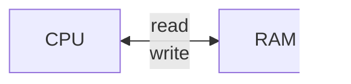

## Модель компьютера



**RAM** (Random Access Memory) - набор пронумерованных ячеек.
Запись по адресу 6C - в ячейку с номером 6C
Ячейки памяти цельные - чтение и запись применяется ко всей, а не к части

Размер ячейки в модели - 1 байт

**CPU** (Central Processing Unit) - исполняет программы
[[#Регистры]] - самая быстрая память компа, располагается на плате процессора

#### Регистры

| Регистр или группа | Расшифровка               | Список                                                        | Перевод/назначение                                                                     |
| ------------------ | ------------------------- | ------------------------------------------------------------- | -------------------------------------------------------------------------------------- |
| IP                 | Instruction pointer       |                                                               | Указатель на следующую инструкцию к выполнению                                         |
| GPRs               | General purpose registers | `AX, CX, DX, BX, SP, BP, SI, DI` (по состоянию x86 *78 года*) | 16 битные регистры<br>Регистры промежуточных данных операций (каждый отвечает за свое) |
|                    |                           |                                                               |                                                                                        |
#### Инструкции

Специфичные для `ASM64` моменты:
- [ModR/M и SIB](https://www.club155.ru/x86cmdformats-modrm)
- [displacement](https://www.c-jump.com/CIS77/ASM/Addressing/lecture.html) (смотри п.2)

##### Перемещение
Мнемоника: `mov dst, src`
```NASM
mov AX, 5
mov CX, 10
mov AX, CX
```
Она же используется для доступа к памяти:
```NASM
; read 10th memory cell to register AX
mov AX, [10]
; read the memory cell with index from BX register to AX
mov AX, [BX]
; write AX to the memory cell with index from BX register
mov [BX], AX
```
При том, поскольку регистры 16-битные - читаются сразу две ячейки 8-битной памяти (идущие подряд). Порядок в регистре - *little endian* (x86). При этом в памяти он располагается как *big endian*.