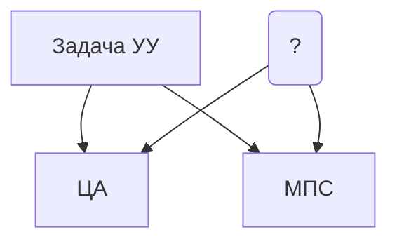
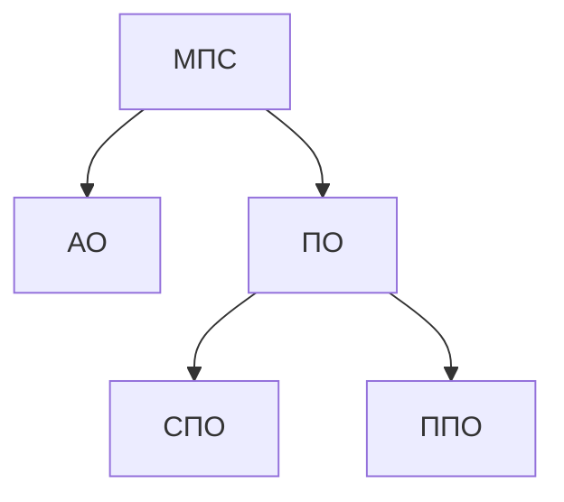
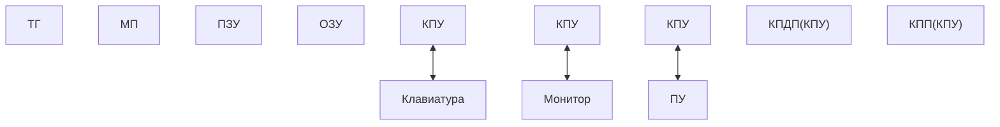

# Организация МПС
АиКС
***
**Зависимости:**
- [[Основные определения]]
- [[Классификация МПС]]
**Структура:
- [[#Процессор]]
- [[#Лекции]]
	- [[#Лекция 1]]
- [[#Литература]]
## Процессор
**Intel 8080A**
Он же **КР580ИК80А**
Со сменой ГОСТов сменил название на **КР580ВМ80А**
#### Основные параметры
| Параметры                                |                       |
| ---------------------------------------- | --------------------- |
| Магистраль данных                        | 8 разрядов            |
| Магистраль адреса                        | 16 разрядов           |
| Объем памяти                             | 64 Кбайт (65536 байт) |
| Количество портов (каналов ввода-вывода) | 256                   |
| Тактовая частота                         | 2 МГц                 |
## Лекция 1
### МП системы

#### Сравнительный анализ ЦА и МПС
МП системы уступают цифровым автоматам по такому параметру, как *быстродействие.* Это объясняется двумя причинами:
1. Классический ЦА строится исходя из принципов минимизации. Его структура оптимизируется под конкретную задачу, поэтому он содержит минимальное количество связей и компонентов;
	- МПС и МП в основе также содержат ЦА, но их автоматы спроектированы таким образом, чтобы была обеспечена возможность решения определенного круга задач, поэтому ЦА МП избыточен. В нем большее количество связей и компонентов.
2. Алгоритм функционирования ЦА задется структурой (схемой) самого автомата, то есть при включении питания ЦА сразу "знает", что ему делать. В МПС алгорим функционирования задается программно. Программа представляет собой совокупность команд. Выполняя программу процессор должен произвести следующие действия:
	1. Извлечь команду из памяти
	2. Распознать (декодировать) ее
	3. Выполнить действие, предписанное командой
2. На все это тратится время.
Это справедливо, если сравнивать современников (ровесников).
***
С другой строны МПС имеют ряд преимуществ перед ЦА:
1. Меньшее количество корпусов ИМС, поэтому более простые и компактные печатные платы;
2. Более высокая надежность вследствие меньшего числа контактов, связей и компонентов;
3. Меньшая потребляемая мощность;
4. Более простые сборка и отладка;
5. Легкость модификации и наращивания функций системы за счет смены ПО.
## Лекция 2

#### Обобщенная структура аппаратного обеспечения
![[Pasted image 20240916102300.png]]

- *КПУ - контроллеры переферийных устройств.* Предназначены для сопряжения МП системы с внешним миром. По сути согласователь протоколов.
- *КПДП - контрллер прямого доступа к памяти.* 
- *КПП - контроллер приоритетных прерываний.*
- *ТГ - тактовый генератор.* Задает тактовую частоту системе.
- *МД(ШД) - магистраль данных (шина данных).*
- *МА(ША) - магистраль адреса (шина адреса).*
- *МУ(ШУ) - магистраль управление (шина управления)*
#### Микропроцессор КР580
![[Pasted image 20240916113404.png]]
- **ЛМД** - локальная магистраль данных
- **MD МПС** - магистраль данных МПС
- **МУ МПС** - магистраль управления МПС
- **МА МПС** - магистраль адреса МПС
- *С помощью них процессор сопрягается с...*
	- **BF D** (8 разрядный) - буфер данных (двунаправленный, Z-стабильный)
	- **BF Adr** (16 разрядный) - буфер адреса (только на выдачу, Z-стабильный)
- *ALU, DC COM - основные комбинационные ресурсы.*
	- **ALU** (8 разрядное) - арифметико-логическое устройство (комбинационное, без памяти). Может выполнять арифметические операции (сложение, вычитание) и логические операции (И, ИЛИ, исключающее ИЛИ, НЕ). Выполняет операции, как правило, над двумя операндами. Первым операндом, за исключением унарных операций, является содержимое аккумулятора. Второй операнд поступает из регистра временного хранения T (temp). Результат операции, как правило, помещается в аккумулятор. **Reg A** служит как некий разрыватель обратной связи.
	- **DC Com** - декодер (дешифратор) команды. Дешифрирует код, находящийся в регистре команд.
- *A, F, B, C, D, E, H, L, SP, PC - регистры. В основном - программно доступные ресурсы.*
	- **A** - аккумулятор
	- **T** - регистр временного хранения. Информация поступает автоматически из РОН (регистры общего назначения) или ЗУ (запоминающие устройства). *Программно-недоступный ресурс.*
	- **F** - регистр флагов (признака). В нем формируется характеристика результата последней операции, проведенной в ALU.
	- **Reg Com** - регистр команд. В начале выполнения каждой команды в него помещается код команды. И остается там неизменным до окончания времени исполнения команды. *Программно-недоступный ресурс.*
	- **РОН** - регистры общего назначения. 6 равноправных восьмиразрядных регистров (ячейки сверх-оперативной памяти). Их можно компоновать в пары.
		- **B, C, D, E, H, L**
		- Регистровые пары (как правило хранят адреса/указатели):
			- **BC, DE** - пары с минимальными возможностями
				- `LDAX RR`
				- `STAX RR`
			- **HL** - пара с максимальными возможностями
	- **РСН** - регистры специального назначения.
		- **SP** - Stack pointer. *Стек растет вниз, в сторону младших адресов.*
		- **PC** - Program counter (программный счетчик). Во время выполнения текущей команды в нем формируется адрес следующей.
		- **Reg Adr** - регистр адреса. Содержит адрес того ресурса (ячейки памяти или порта), к которому производится обращение. По сути пробегает по всем адресам программы в памяти. *Программно-недоступный ресурс.*
- Reg A, T, Reg COM, Reg Adr
- *Белым - вспомогательные комбинационные ресурсы.*
	- **MS** - демультиплексор для регистров.
	- **SDC** - схема десятичной коррекции (комбинационная). Используется для преобразования чисел из двоичного формата, в двоично-десятичный формат. Участвует в выполнении операций десятичной коррекции (**DAA**).
- *Непонятный цвет (CU и все что с ним связано) - устройства управления и управляющие сигналы.*
	- CU (control unit)
##### Структура регистра флагов
| S   | Z   | 0   | $A_c$ | 0   | P   | 1   | $C_y$ |
| :-- | --- | --- | ----- | --- | --- | --- | ----- |
- **0, 0, 1** - константы, разряды неизменяемые
- **S, Z, P,** $C_y$ - модифицируемые и программно-контролируемые флаги. Их состояние можно проверить определенныеми командами. *Состояние указанных флагов проверяется командами устловного ветвления.*
	- $C_y$ - флаг переноса (займа). Устанавливается в 1, если в результате операции, проведенной в ALU, возникает перенос за пределы разрядной сетки, или займ (заём) из-за пределов разрядной сетки.
	- **P** - флаг паритета (четности). Устанавливается в 1, если в байте результата присутствует четное количество единиц.
	- **Z (zero)** - флаг нуля. Устанавливается в 1, если в результате операции получен 0. Иначе в 0.
	- **S (sign)** - флаг знака. Устанавливается в 0, если результат положительный или 0. В 0, если результат отрицательный. Флаг актуален **ТОЛЬКО** при работе со знаковыми числами. По сути является копией старшего (левого) разряда результата.
- $A_c$ - модифицируемый но напрямую программно-НЕконтролируемый флаг. (Флаг полупереноса. Отвечает за пернос из младшего полубайта значения в старший).

**Флаг паритета**

| Hex | Bin      | P   |
| :-- | -------- | --- |
| 06  | 00000110 | 1   |
| 03  | 00000011 | 1   |
| 04  | 00000100 | 0   |

## Система команд МП КР580
### Режимы адресации
*Режим адресации* определяет способ (режим) доступа к операндам участвующим в операции.
***
Режимы адресации:
- *Режим прямой адресации.* В командах прямой адресации напрямую или явно указывается адрес операнда, участвующего в операции.
	- Схемы:
		1. 
			1 байт - код операции
			2, 3 байты - Адрес (16)
		2. 
			1 байт - код операции
			2 байт - номер порта
- *Режим непосредственной адресации.* Команде непосредственно указывается операнд, участвующий в операции.
	- Схемы:
		1. 
			1 байт - код операции
			2, 3 байты - data (16)
		2. 
			1 байн - код операции
			2 байт - data (8)
- *Режим регистровой адресации.* Операнды находятся в регистрах или в регистровых парах. Команды однобайтные, имеют самое короткое время выполнения.
	- Схема:
		1 байт - код операции
- *Режим стековой адресации.* Команды однобайтные, но являются самыми долгими. Операнды помещаются в стек или извлекаются из него.
	- Схема:
		1 байт - код операции
- *Режим косвенной адресации.* Команды однобайтные. Гибкий режим адресации. Доступ к операнду, участвующему в операции осуществляется по указателю, имя которого записано в команде. Операнд содержится в ячейке памяти, а в качестве указателя используется одна из регистровых пар.
	- Схема:
		1 байт - код операции

> [!tip]
> Если в мнемонике комнады присутствует символ `I` в конце - это команды режима непосредственной адресации. Например: `LXI H, 0901`

##### Механизмы выполнения команд прямой и косвенной адресации

| Ячейка памяти | Адрес |
| ------------- | ----- |
|               | 0900  |
|               | 0901  |
|               | 0902  |
|               | 0903  |
|               | 0904  |
|               | 0905  |
|               | 0906  |
|               | 0907  |
|               | 0908  |
|               | 0909  |
|               | 090A  |
|               | 090B  |
|               | 090C  |
|               | 090D  |
|               | 090E  |
|               | 090F  |
*Прямая адресация:*
LDA 0900 (запись в аккумулятор)
STA 0901 (чтение из аккумулятора)

*Косвенная адресация:*
LDAX B (обращение к ячейке памяти по адресу из регистровой пары BC и чтение ее в аккумулятор)
STAX D (обращение к ячейке памяти по адресу из регистровой пары DE и запись в нее информации из аккумулятора)

MOV A, M (обращение к ячейке памяти по адресу из регистровой пары HL и чтение содержимого ячейки памяти в аккумулятор)
MOV M, A (обращение к ячейке памяти по адресу из регистровой пары HL и запись в ячейку памяти данных из аккумулятора)

ADD M (обращение к ячейке памяти по адресу из регистровой пары HL, чтение значения из него и сложение его со значением в аккумуляторе)

> [!tip]
>Переносы происходят по правилу копирования. Оригинальные данные остаются в оригинальной ячейке.


### Типы команд
Обобщенное имя регистра - R
Обобщенное имя регистровой пары - RR
Обращение к адресу - Adr
Обращение к порту - Port
Данные - $data_8$, $data_{16}$
Содержимое ресурса - (R), (RR), (Adr), (port), ((RR)) *содержимое ячейки памяти, адрес которой содержится в регистровой паре*.
PSW - регистровая пара AF (пара спец применения)
***
*Тип команд* определяет специфику или направленность выполняемых или действий.
Типы:
- Пересылок или передачи данных
- Арифметико-логические команды
- Комнады преобразования содержимого регистров
- Команды ветвления
- Команды различного назначения

##### Команды пересылки или передачи данных
Приводят к перемещению информации (по принципу копирования) между регистрами либо между регистром и ячейкой памяти. *Не оказывают влияния на флаги*.

MOV $R_1$, $R_2$ ; ($R_2$) -> ($R_1$)
MOV $R$, $M$ ; ((HL)) -> ($R$)
MOV $M$, $R$ ; ($R$) -> ((HL))
MVI $R$, $data_8$ ; $data_8$ -> (R)
MVI M, $data_8$ ; $data_8$ -> ((HL))
LXI $RR$, $data_{16}$ ; $data_{16}$ -> $RR$
LDA $Adr_{16}$ ; $(Adr_{16})$ -> (A)
STA $Adr_{16}$ ; (A) -> $(Adr_{16})$
LDAX $RR$ ; ((RR)) -> (A) ; RR - { BC, DE }
STAX $RR$ ; (A) -> ((RR)) ; RR - { BC, DE }
XCHG  ; (DE) <-> (HL)
SPHL  ; (SP) <-> (HL)

##### Арифметико-логические команды
Выполняются, *как правило*, над двумя операндами. Первый операнд *всегда* в аккумуляторе. Результат операции, *как правило*, помещается в аккумулятор. *Команды оказывают влияние на флаги*

**Арифметические команды**

С двумя операндами:

ADD R ; (A) + (R) -> (A) ; (F)
ADD M ; (A) + ((HL)) -> (A) ; (F)
ADI $data_8$ ; (A) + $data_8$ -> (A) ; (F)

С флагом переноса:

ADC R ; (A) + (R) + ($C_y$) -> (A) ; (F)
ADC M ; (A) + ((HL)) + ($C_y$) -> (A) ; (F)
ACI $data_8$ ; (A) + $data_8$ + ($C_y$) -> (A) ; (F)

**Команды вычитания**

С флагом переноса:

SBB R ; (A) - (R) - ($C_y$) -> (A) ; (F)
SBB M ; (A) - ((HL)) - ($C_y$) -> (A) ; (F)
SBI $data_8$ ; (A) - $data_8$ - ($C_y$) -> (A) ; (F)

С двумя операндами:

SUB R ; (A) - (R) -> (A) ; (F)
SUB M ; (A) - ((HL)) -> (A) ; (F)
SUI $data_8$ ; (A) - $data_8$ -> (A) ; (F)

**Команды сравнения** влияют *только* на флаги. Результат в регистры (или акк) не записывается.

CMP R ; (A) - (R) -> (F)
CMP M ; (A) - ((HL)) -> (F)
CPI $data_8$ ; (A) - $data_8$ -> (F)

**Сложение регистровых пар** *Применяются редко, выполняются долго.* На флаги не влияют.

DAD RR ; (HL) + (RR) -> (HL)
DAD SP ; (HL) + (SP) -> (HL)

**Команды логических операций**

*И*

ANA R ; $(A)\cap (R)$ -> (A) ; (F)
ANA M ; $(A)\cap ((HL))$ -> (A) ; (F)
ANI $data_8$ ; $(A)\cap data_8$ -> (A) ; (F)

1. Используется для выборочной установки разрядов аккумулятора в 0 (сброса).
2. Используются для выборочной проверки разрядов аккумулятора. Для этого на аккумулятор накладывается маска, содержащая 1 в проверяемом разряде. В результате будет получено число, в котором все разряды, кроме проверяемого обнулены. Далее значение проверяемого разряда контролируется по флагу Z.

*Или*

ORA R ; $(A) \cup (R)$ -> (A) ; (F)
ORA M ; $(A) \cup ((HL))$ -> (A) ; (F)
ORI $data_8$ ; $(A) \cup data_8$ -> (A) ; (F)

Используются для выборочной установки разрядов аккумулятора в 1. Для этого на аккумулятор накладывается маска, содержащая 1 для выбранных разрядов.

*Исключающее или (XOR)*
$F = a \oplus b$

XRA R ; $(A) \oplus (R)$ -> (A) ; (F)
XRA M ; $(A) \oplus ((HL))$ -> (A) ; (F)
XRI $data_8$ ; $(A) \oplus data_8$ -> (A) ; (F)

Команды данной группы используют для выборочной инверсии разрядов аккумулятора. Для этого на аккумулятор накладывается маска, содержащая 1 в инвертируемых разрядах.

*Не*

CMA ; ($\bar A$) ; (F)
CMC ; ($\bar C_y$)

Выполняет операции инвертирования целиком всего ресурса.

##### Команды преобразования содержимого ресурсов.
Команды данного типа относятся к *унарным* операциям. Выполняются в *ALU*. Результат помещается в позицию операнда. *Операции над байтовыми* (8-разрядными) ресурсами *влияют на флаги*, но операции *над 2-байтовыми* (16-разрядными регистровыми парами) *не влияют* на флаги.

**Команды инкрементов**
*Влияют на флаг Z, на $C_y$ - нет*

INR R ; (R) + 1 -> (R) ; (F)
INR M ; ((HL)) + 1 -> ((HL)) ; (F)

INX RR ; (RR) + 1 -> (RR)
INX SP ; (SP) + 1 -> (SP)

**Команды декрементов**
*Влияют на флаг Z, на $C_y$ - нет*

DCR R ; (R) - 1 -> (R) ; (F)
DCR M ; ((HL)) - 1 -> ((HL)) ; (F)

DCX RR ; (RR) - 1 -> (RR)
DCX SP ; (SP) - 1 -> (SP)

**Команды сдвигов**
Сдвиги выполняются над содержимым *аккумулятора*, кроме того, участвует флаг $C_y$. Все сдвиги выполняются по кольцу (кольцевые сдвиги). Длина кольца может быть 8 или 9 разрядов (бит). Сдвиги бывают *вправо* и *влево*. За одну команду происходит сдвиг на 1 разряд.


|     | <-  | ->  |
| :-: | :-: | :-: |
| 8р  | RLC | RRC |
| 9р  | RAL | RAR |
При умножении или делении на 2 рекомендуется использовать 9-тиразрядные сдвиги с предварительным обнулением $C_y$. 8-миразрядные операции могут вызвать ошибки.

##### Команды ветвления
Позволяют изменить ход или маршрут выполнения программы.
Бывают двух категорий:
1. Команды безусловного ветвления - перенаправляют процессор в новое место (в новую точку программы) *без проверки* каких бы то ни было *условий*. Аналог в C: goto.
2. Команды условного ветвления - командой *проверяется выполнение некоторого условия*. Если итог проверки - истина, то ветвление производится. Иначе выполняется следующая за командой ветвления операция (команда). В качестве условий рассматриваются *состояния индивидуальных флагов* ($C_y$, P, Z, S). Каждый флаг можно проверить на *равенство нулю или единице*. Команды ветвления на флаги *не влияют*.

**Команды переходов**

| Команды переходов | Безусловное ветвление | Условное ветвление                                                      |
| ----------------- | --------------------- | ----------------------------------------------------------------------- |
|                   | JMP $Adr_{16}$        | JC $Adr_{16}$ ; переход на $Adr_{16}$, если $C_y = 1$                   |
|                   |                       | JNC $Adr_{16}$ ;  ----##---- если $C_y = 0$                             |
|                   |                       | JZ $Adr_{16}$ ; переход на $Adr_{16}$, если $Z = 1$, т.е. результат = 0 |
|                   |                       | JNZ $Adr_{16}$ ; ----##---- если $Z = 0$, т.е. результат != 0           |
|                   |                       | JPE $Adr_{16}$ ; переход на $Adr_{16}$, если P = 1                      |
|                   |                       | JPO $Adr_{16}$ ; ----##---- если P = 0                                  |
|                   |                       | JM $Adr_{16}$ ; переход на $Adr_{16}$, если S = 1, т.е. результат < 0   |
|                   |                       | JP $Adr_{16}$ ; ----##---- если S = 1, т.е. результат < 0               |

**Команды вызова подпрограмм**

| Команды вызова подпрограмм | Безусловное ветвление                                         | Условное ветвление                                              |
| -------------------------- | ------------------------------------------------------------- | --------------------------------------------------------------- |
|                            | CALL $Adr_{16}$ ; вызывает подпрограмму по указанному адресу. | СC $Adr_{16}$ ; переход на ПП, если $C_y = 1$                   |
|                            |                                                               | СNC $Adr_{16}$ ;  ----##---- если $C_y = 0$                     |
|                            |                                                               | СZ $Adr_{16}$ ; переход на ПП, если $Z = 1$, т.е. результат = 0 |
|                            |                                                               | СNZ $Adr_{16}$ ; ----##---- если $Z = 0$, т.е. результат != 0   |
|                            |                                                               | СPE $Adr_{16}$ ; переход на ПП, если P = 1                      |
|                            |                                                               | СPO $Adr_{16}$ ; ----##---- если P = 0                          |
|                            |                                                               | СM $Adr_{16}$ ; переход на ПП, если S = 1, т.е. результат < 0   |
|                            |                                                               | СP $Adr_{16}$ ; ----##---- если S = 1, т.е. результат < 0       |

При выполнении команды:
CALL $Adr_{16}$
1. (PC) -> (стек)
2. (SP) - 2 -> (SP)
3. JMP $Adr_{16}$

**Команды выхода из подпрограмм**

| Команды выхода из подпрограмм | Безусловное ветвление | Условное ветвление                                 |
| ----------------------------- | --------------------- | -------------------------------------------------- |
|                               | RET                   | RC ; выход, если $C_y = 1$                         |
|                               |                       | RNC ;  ----##---- если $C_y = 0$                   |
|                               |                       | RZ ; выход, если $Z = 1$, т.е. результат = 0       |
|                               |                       | RNZ ; ----##---- если $Z = 0$, т.е. результат != 0 |
|                               |                       | RPE ; выход, если P = 1                            |
|                               |                       | RPO ; ----##---- если P = 0                        |
|                               |                       | RM ; выход, если S = 1, т.е. результат < 0         |
|                               |                       | RP ; ----##---- если S = 1, т.е. результат < 0     |
При выполнении команды:
RET
1. (стек) -> (PC)
2. (SP) + 2 -> (SP)

##### Команды вызова системных подпрограмм

$RST i ; i = \{0, 1, ... 7\}$

Вызов системной подпрограммы по адресу:
$Adr_{SSP} = 0000 + i * 8$
(PC) -> (стек)
(SP) - 2 -> (SP)

Комадны $RST i$ - это команды вызова системных подпрограмм. Данные команды обращаются к таблице векторов микропроцессора. Таблица векторов располагается, начиная с нулевого адреса памяти. Состоит из восьми разделов по 8 байт каждый. ПО сути индекс `i` указывает номер раздела. Если объем системной подпрограммы не превышает 8 байт - то ее можно расположить в рамках раздела. Если же объем превышает 8 байт - то подпрограмма располагается в любом доступном месте памяти, а в разделе таблицы векторов указывается команда перехода (JMP) на адрес начала подпрограммы.

![[Pasted image 20241014110919.png|Таблица векторов]]

> [!Tip]
> RST 0 - рестарт системы

##### Неклассифицированные команды

IN PORT ; (PORT) -> (A)
OUT PORT ; (A) -> (PORT)

**Стек**

STC ; 1 -> ($C_y$)

PUSH RR ; (RR) -> (стек) ; (SP) -  2 -> (SP)
PUSH PSW ; (PSW) -> (стек) ; (SP) -  2 -> (SP)

POP RR ; (стек) -> (RR) ; (SP) +  2 -> (SP)
POP PSW ; (стек) -> (PSW) ; (SP) +  2 -> (SP)

**Прочие**

EI (enable interact) - разрешает аппаратные прерывания МП от внешних источников.
DI (disable interact) - запрещает аппаратные прерывания МП от внешних источников.

NOP (no program) - нет операции.
HLT - останов процессора (полный, полнейший).


## Взаимодействие микропроцессора с аппаратным окружением

### Организация временных интервалов в МП системах

1. Минимальным временным интервалом, распознаваемым микропроцессором, является *машинный такт*. Это *период синхросигналов* тактового генератора.
	![[Pasted image 20241021102450.png|Схема машинного такта МПС КР580.]]
	Машинный такт МПС КР580 - 0,5 мкс.

2. Вторым временным интервалом, распознаваемым процессором, является *машинный цикл*. Машинный цикл - это *время, необходимое для извлечения одного байта информации из памяти или выполнения некоторых действий, определяемых одним машинным циклом*. *Длительность машинного цикла* составляет от 3 до 5 машинных тактов.
3. Третьим временным интервалом, распознаваемым процессором, является *ТК (кремя выполнения команды)*. Это время, складывающееся из событий:
	1. Получение кода команды;
	2. Декодирование этого кода;
	3. Выполение действий, предписанных кодом команды.
	*Длительность ТК* составляет от 1 до 5 машинных циклов.

Различают *10 типов* машинных циклов:
1. Извлечение (чтение) кода команды из памяти. M1 - условное обозначение;
2. Чтение данных из памяти;
3. Запись данных в память;
4. Извлечение из стека;
5. Запись в стек;
6. Ввод данных из порта;
7. Вывод (запись) данных в порт;
8. Цикл обслуживаний (внешних аппаратных) прерываний (*запросов на них*);
9. Останов процессора;
10. Обслуживание прерываний в режиме останова.

*Первым машинным циклом при выполнении любой и каждой команды является МЦ M1.*
Все машинные циклы задают определенный формат взаимодействия МП с его аппаратным окружением. Поскольку действия различны и противоположны (противонаправлены), то аппаратное окружение *должно быть настроено* на определенное взаимодействие (функционирование), т.е. *на конкретный машинный цикл*. Для этого в первом такте каждого машинного цикла МП формирует специальное управляющее слово и передает его системному контроллеру. Системный контроллер в определенном порядке генерирует управляющие сигналы, тем самым настраивая аппаратное окружение.

![[Pasted image 20241021105527.png]]
Здесь * - время выдачи управляющего слова.

### Примеры представлений команд в МЦ
Команда *MVI C, 04* будет представлять собой 2 цикла:
1. M1
2. Чтение ЗУ

LXI H, 0900
1. M1
2. Чтение ЗУ
3. Чтение ЗУ

MOV A, B
1. M1

ADD B
1. M1

SUI 03
1. M1
2. Чтение ЗУ

STA 0906
1. M1
2. Чтение ЗУ
3. Чтение ЗУ
4. Запись в ЗУ

IN 05
1. M1
2. Чтение ЗУ
3. Ввод из порта

OUT 05
1. M1
2. Чтение ЗУ
3. Вывод в порта

JNZ 0805
1. M1
2. Чтение ЗУ
3. Чтение ЗУ

LDAX D
1. M1
2. Чтение ЗУ

STAX B
1. M1
2. Запись в ЗУ

ADD M
1. M1
2. Чтение ЗУ

INX H
1. M1

INR M
1. M1
2. Чтение ЗУ
3. Запись в ЗУ

PUSH D
1. M1
2. Запись в стек
3. Запись в стек

POP B
1. M1
2. Извлечение из стека
3. Извлечение из стека

CALL 0918
1. M1
2. Запись в стек
3. Запись в стек
4. Чтение ЗУ
5. Чтение ЗУ

## Функционирование МПС в циклах чтения или приема информации
![[Pasted image 20241028102300.png|Архитектура взаимодействия компонентов]]
*ПУ* - переферийные устройства
*BF D* - буфер данных
*MD* - магистраль данных
*УВВ* - устройства ввода-вывода
Частный случай УВВ:
	*КПУ* - контроллер переферийных устройств

#### Машинные циклы, относящиеся сюда
- M1
- Чтение ЗУ
- Ввод из порта
- Извлечение из стека

#### Машинные такты
1. Формирование УС и выдача его в СК (*MA активируется*)
2. СК формирует МУ (магистраль управления) МПС (*управляющие сигналы*)
3. Чтение (прием) информации (данных)
4. *4 и 5* обработка принятой информации (*магистрали системы свободны/не заняты*)

##### Подробнее
1. На первом такте микропроцессор формирует управляющее слово, определяющее тип машинного цикла. УС выдается на магистраль данных. На магистрали установлен буфер данных, управляемый сигналом DBIN (Data Byte Input) и на этом такте буфер закрыт. Поэтому управляющее слово доступно только системному контроллеру. Активируется магистраль адреса, формируется адрес;
2. На втором такте управляющее слово записывается в системный контроллер и он формирует магистраль управления, т.е. генерирует необходимые управляющие сигналы. Буфер данных все еще закрыт сигналом DBIN;
3. На третьем такте DBIN активируется, в результате буфер данных конфигурируется на пропуск информации к процессору и активируется один из сигналов чтения - либо чтение ЗУ, либо чтение (ввод из) порта;
4. На 4 и 5 тактах проводится обработка принятой информации.

## Функционирование МПС в циклах выдачи информации
![[Pasted image 20241028103909.png|Архитектура взаимодействия компонентов]]

#### Машинные циклы, относящиеся сюда
- Запись данных в ЗУ
- Запись в стек
- Вывод в порт

#### Машинные такты
1. Формирование УС и выдача его в СК
2. СК формирует МУ (магистраль управления) МПС (*управляющие сигналы*)
3. МП выдает информацию для записи в ресурсы (активируется сигнал WR)

##### Подробнее
1. На первом такте микропроцессор формирует управляющее слово, определяющее тип машинного цикла. УС выдается на магистраль данных. На магистрали установлен буфер данных, управляемый сигналом DBIN (Data Byte Input) и на этом такте буфер закрыт. Поэтому управляющее слово доступно только системному контроллеру. Активируется магистраль адреса, формируется адрес;
2. На втором такте управляющее слово записывается в системный контроллер и он формирует магистраль управления, т.е. генерирует необходимые управляющие сигналы. Буфер данных все еще закрыт сигналом DBIN;
3. На третьем такте процессор выставляет информацию на магистраль данных и ктивирует сигнал записи (WR). Этим сигналом буфер данных открывается на выдачу от процессора к аппаратному окружению. Кроме того, активируются элементы, разрешающие проход определенных сигналов управления (*ЗП ЗУ или ЗП порт*). Таким образом информация от МП записываестя в выбранный ресурс.

*Бывают ситуации, когда МП взаимодейтсвует с медленными устройствами. Тогда 3 такт не успеет завершиться. Для таких случаев у процессора существует специальный сигнал готовности (памяти). Если он его не получает - то вводит сигналы ожидания.*

## Типовые принципы организации подключения и программирования КПУ
*КПУ* - контроллер переферийных устройств
***
#### Для чего
1. Выполняет функцию согласования протоколов
2. Выполняет функцию согласователя электрических протоколов
3. Способны обладать некоторой степенью автономности. Помощник процессора в деле информационного обмена

*Скорость передачи ниже, чем в рамках процессора.*

### Типовые принципы огранизации КПУ
![[Pasted image 20241028111144.png]]
*I/O P* (Input/Output port) - Общее обозначение КПУ на схеме
Слева:
*БФ D* - Буфер данных. Трехстабильный - может пребывать в Z-состоянии, если CS (chip select) неактивен
*DC* - Декодер для выбора внутренних ресурсов контроллера
*СХ В/В* - Схема ввода/вывода
Справа:
*РУС* - регистр управляющих слов (инструкций). Предназначен для записи в него управляющих слов, определяющих решим функционирования КПУ
*РСС* - регистр слова состояния. Предназначен для хранения слова состояния КПУ, представляющего собой вектор мгновенных значений ключевых параметров КПУ. Может хранить информацию о готовности и об ошибках обмена. Считывается и анализируется МП. *Предназначен только для чтения*.
*A, B, C* - каналы информационного обмена с переферийными устройствами.
***
Все КПУ - *программируемые* устройства. До начла его использования по целевому назначению необходимо запрограммировать КПУ.

#### Расширенная схема
![[Pasted image 20241111101425.png]]

#### Пример
D0 - A
D1 - B
D2 - C
D3 - РУС/РСС
***
XA - C
XB - РУС/РСС
XC - A
XD - B

*На выборку подается 2 младших разряда:*
![[Pasted image 20241111101930.png]]
Обычно так не делают, но....

### Типовые принципы подключения КПУ к МПС
![[Pasted image 20241111104402.png]]

Как правило к КПУ подключают пространство портов, но *допустимо* и, в ряде случаев, *так делается* - подключать КПУ как *ячейки памяти*. Этот прием называется отображением в память.

В реальных МП системах, как правило, количество КПУ *больше одного*. В этом случае необходимо создать *подсистему адресной выборки* каждого конкретного КПУ. В не зависимости от количества контроллеров в системе все их входные (внутрисистемные) линии соединяются *по одноименным связям* и подключаются к соответствующим линиям (магистралям) МП системы *за исключением входа CS*. Сигнал на этом входе *выбирает контроллер*, то есть он разрешает информационный обмен между МП и контроллером. За счет того, что все контроллеры программируемые и могут функционировать относительно автономно, то состояние линии CS не влияет на взаимодейтсвие КПУ с переферийными устройствами.

![[Pasted image 20241111104858.png]]

### Типовые принципы программирования КПУ
Все КПУ являются *программируемыми*. Они настраиваются на определенный режим функционирования с помощью инструкций или управляющих слов. Эти слова необходимо записать в РУС. В большинстве случаев одной инструкции недостаточно и требуется последовательная запись в РУС нескольких инструкций. Только после записи всех инструкций (управляющих слов) появляется возможность использовать КПУ по целевому назначению. В большинстве случаев перед началом непосредственно информационного обмена процессор должен узнать о готовности КПУ к нему. Для этого процессор считывает РСС и проверяет бит (признак) готовности. Кроме того, процессор может просмотреть (проверить) состояние флагов ошибок контроллера (из РСС).

## Организация информационного обмена между МПС и ПУ
*ПУ* - переферийные устройства
***
Получили распространение 3 вида (способа) информационного обмена:
1. [[#Программный обмен]];
2. [[#Прямой доступ к памяти|Обмен в режиме прямого доступа к памяти]] (DMA, ПДП);
3. [[#Обмен по прерываниям. Прерывания|Обмен по прерываниям]].

### Программный обмен
Является самым простым в плане понимания и реализации, но одновременно самым неэффективным способом. При его использования создаются специальные процедуры, в которых прописываются взаимодействия с КПУ.

![[Pasted image 20241111112021.png]]
![[Pasted image 20241111112029.png]]

В случае отсутствия (признака) готовности дальнейшие события могут развиваться по одному из двух сценариев (вариантов):
1. Нет (1) - процессор возвращается к чтению РСС и дальнейшему анализу. В этом случае система будет дожидаться появления готовности и "гарантируется" факт информационного обмена. Однако, из-за меньшего быстродействия каналов взаимодействия с переферийными устройствами, МП система может подзависать (подтормаживать) и машинное время будет расходоваться неэффективно. Не исключена вероятность полного зависания системы;
2. Нет (2) -  временные потери в данном случае минимизируются, поскольку нет ожидания готовности, но и обмен не происходит. Процессор будет выполнять дальнейшие действия, но интересующие его данные все-таки не получены, поэтому через некоторое время процессору следует вернуться к анализу готовности в РСС. Временной промежуток до повторного возврата выбирается исходя из поставленной задачи или особенностей технологического процесса.

Используется, если *дальнейший процесс вычисления без полученных данных невозможен*.

#### Оценка временных затрат при программном способе обмена

|     | Основная программа | МЦ  |
| --- | ------------------ | --- |
|     | JMP Proc           | 3   |
| R:  |                    |     |

|     | Процедура   | МЦ  |
| --- | ----------- | --- |
|     | IN РСС      | 3   |
|     | ANI mask    | 2   |
|     | JNZ R       | 3   |
|     | MVI C, N    | 2   |
|     | LXI H, Addr | 3   |
| M:  | IN канал i  | 3   |
|     | MOV M, A    | 2   |
|     | INX H       | 1   |
|     | DCR C       | 1   |
|     | JNZ M       | 3   |
|     | JMP R       | 3   |

![[Pasted image 20241118102355.png]]

*Красный*: однократно исполняемые (необходимые, выполняться будут всегда, вне зависимости от флага)
*Синий*: 1 раз при "гот"
*Зеленый*: Пересылка всего массива из ПУ
*Желтый*: 1 раз - заверш проц
***
$$M_c = 11 + 5 + 10 * N + 3 = 19 + 10 * N$$
$$M_t = 95 + 48 * N$$
$$t_{microseconds} = 47,5 + 24 * N$$
***
**Пересылка одного слова**
На программном уровне:
10 мц = 48 мт = 24 мкс

На аппаратном уровне:
ОЗУ:
	t_здрс (от/до)
		800 мс
		400 мс

***
Проведем оценку временных затрат на реализацию способа програмного обмена. Все команды, задействованные в этом обмене, разделены на 4 группы. Группа *красных* будет выполняться всегда при попытке процессора совершить информационный обмен, но однократно. В случае неготовности КПУ к обмену - это просто потерянное время. Группы *синих и желтых* - единожды выполняемые команды при обнаружении готовности. В этом случае команды *красной, синей и желтой* групп представляют собой своеобразные "накладные расходы" на процедуру информационного обмена. *Зеленая* группа команд реализует непосредственно информационный обмен между КПУ и МП.

Цифрами подписано количество машинных цикров для каждой команды. Формулы показывают преобразование от машинных циклов к машинным тактам и далее к микросекундам. Без учета "накладных расходов" время затраченное на обмен одним информационным словом составляет около 24 микросекунд.

На аппаратном уровне в МП системах самым низким быстродействием обладает запоминающее устройство. Для рассматриваемой МПС быстродействие ОЗУ (время цикла адреса) составляет порядка 0,8 мкс. То есть на аппаратном уровне МП система способна проводить информационный обмен примерно в 25 раз быстрее, чем это происходит на программном уровне. С учетом этой особенности был разработам способ информационного обмена с прямым доступом к памяти (ПДП, DMA)

**Вывод:** *Эффективен, если требуются небольшие объемы памяти (короткие сообщения).*

### Прямой доступ к памяти
ПДП
DMA (Direct Memory Access)
***
Существует 2 разновидности реализации ПДП:
1. В режиме [[#Режим идентификации состояния памяти (магистралей)|идеидентификации состояния памяти]] (состояния магистралей)
2. [[#Режим с пропуском тактов]]
Оба варианта *нуждаются* в специализированном *контроллере ПДП* (КПДП). Он нужен для реализации обмена. Обмен он проводит *сам*, *без участия МПС* и *на аппаратном уровне*.

#### Режим идентификации состояния памяти (магистралей)
![[Pasted image 20241118111709.png]]
*Красным*: магистрали МПС заняты
*Синим*: магистрали МПС свободны

В течение выполнения первых трех машинных тактов магистрали МП системы заняты. На 4 и 5 тактах микропроцессор обрабатывает принятую (полученную) им информацию, со своим аппаратным окружением он не общается. Поэтому магистрали МП системы свободны. Этот временной интервал можно задействовать для реализации ПДП.

**Плюсы:**
- Экономия времени за счет отсутствия необходимости выполнять программы процедуры обмена;
- Параллельное выполенение двух процессов:
	- Обработка микропроцессором принятой информации;
	- Информационный обмен, реализуемый контроллером ПДП.

**Минусы:**
- Наличие дополнительного компонента (блока) в составе МПС;
- Циклы выдачи (записи) трехтактовые, потому на них ПДП не сделать;
- За один МЦ чтения можно передать в среднем одно-два слова;
- Нельзя просто отсчитать количество циклов до начала ПДП. Необходима система идентификации номера такта.

В результате асинхронность обмена и задержки в нем могут привести к тому, что МПС к нужному моменту не получит необходимые данные. Тогда он будет вынужден ждать.

#### Режим с пропуском тактов
Режим с пропуском (займом) тактов более распространен.

![[Pasted image 20241125090435.png|Процесс передачи данных из ПУ в память]]

Здесь *красным* - Сигнал *запрос захвата*, немаскируемый, от него процессор отказаться не может.
***
Прока контроллер не получил HLDA он не начнет работу. Буферы в *Z состоянии* (откл).

Инициатором обмена может быть КПУ. Для этого он посылает заявку КПДП. Помимо этого, инициатором может быть и сам МП, но заявку он отправит не напрямую, а через посредников. С получением заявки на обмен КПДП отправляет процессору сигнал *запрос захвата*. Этот сигнал поступает на вход HOLD микропроцессора. Процессор не может замаскировать этот сигнал, он обязан на него реагировать. В этом случае МП завершает выполнение текущей команды и переводит буферы магистралей в *Z состояние*, то есть отключается от магистралей системы. После этого процессор по *линии* `HLDA` посылает контроллеру ПДП сигнал подтверждения захвата. Только после получения этого сигнала контролллер ПДП может вступить в работу по передаче данных. Теперь он управляет системой. Контроллер генерирует необходимые управляющие и адресные сигналы, в результате чего устанавливается прямой канал передачи информации между КПУ и ОЗУ. По заврешении передачи массива контроллер выключает сигнал `Hold`. Распознав это МП снимает *сигнал* `HLDA` и переводит свои буферы в рабочее состояние. Контроль над системой **восстановлен**.

До использования контроллера ПДП (КПДП) по целевому назначению он должен быть запрограммирован. Контроллеру сообщается:
1. Направление передачи данных
2. Адрес начала массива в памяти
3. Количество элементов в массиве

**Преимущества**:
1. Процесс обмена совершается на более высокой скорости, чем в предыдущем варианте. Совершается интегрально (комплексно) - весь объем данных передается в рамках одного процесса;

**Недостатки**:
1. В период работы КПДП микропроцессор может либо полностью бездействовать (справедливо для КР580), либо исполнять программу, находящуюсья в кеше (кеш-памяти), но при условии, что она работает только с данными кеша

**Вывод:** *Эффективен для обмена массивами данных.*

### Обмен по прерываниям. Прерывания
#### Прерывания
**Прерывание** - это процесс переключения с выполнения текущей задачи или программы на другую, более актуальную (приоритетную), в данный момент времени, задачу или программу.

При выполнении процедуры прерываний МП переходит к выполнению подпрограмм. Как правило, по окончанию подпрограммы происходит возврат к прерванной задаче.

Существует 3 разновидности прерываний:
1. [[#Программные прерывания]];
2. [[#Внутренние аппаратные прерывания]];
3. [[#Внешние аппаратные прерывания]].

##### Программные прерывания
Программные прерывания вызываются командами группы `CALL` (как безусловная, так и условные команды).

Программные прерывания немаскируемые, то есть процессор не может отказаться от 
выполнения команды `CALL`, он будет обязан перейти в подпрограмму.

![[Pasted image 20241125092711.png]]
*Коротко о том, почему подпрограммы не вызываются командами `JMP`.*

![[Pasted image 20241125094341.png|Схема процесса выполнения программного прерывания]]

Действия команд более подробно рассмотрены в разделе [[#Команды ветвления]].

Выполняя основную программу микропроцессор имел некоторый определенный контекст (смысл) действий. Он использовал свои регистры и значения флагов. Переходя к выполнению подпрограммы, в общем случае, микропроцессор переходит к другой задаче, со своим смыслом или контекстом действий. Соответственно, здесь тоже могут использоваться те же регистры и флаги, но в ином смысловом применении. Такой переход между процессами называется *первым контекстным переключением*.

По завершении подпрограммы процессор снова меняет смысл действий, то есть имеет место быть *второе контекстное переключение*.

Для борьбы с этим явлением необходимо принудительно сохранять в стеке все важные для основной программы данные (в начале подпрограммы):

``` asm
PUSH B
PUSH D
PUSH H
PUSH PSW
```

Соответственно в конце подпрограммы все то же самое, но наоборот:

``` asm
PUSH PSW
PUSH H
PUSH D
PUSH B
```

*Данный тип прерываний можно использовать при реализации программного обмена.*

##### Внутренние аппаратные прерывания

В специализированных, как правило управляющих, микропроцессорах в состав кристалла включаются простейшие КПУ с определенным минимальным набором функций. Соответственно они также обладают определенной автономией. Выполнив порученную им функцию (процедуру), контроллеры сообщают об этом устройству управления процессором путем формирования сигнала *запроса на прерывания*.

![[Pasted image 20241125102306.png|Таблица векторов прерываний]]

В структуре таких микропроцессоров с каждым из КПУ связан свой, закрепленный за ним раздел таблицы векторов прерываний. Внутри раздела записывается веткор перехода на подпрограмму обработки запроса.

Разработчик МП системы сам выбирает место расположения подпрограммы обработки запросов, но выбрать расположение таблицы векторов и её разделов он не может. Расположение предписано архитектурой процессора, поэтому в раздел таблицы, предназначенный для обслуживания запроса от таймера счетчика необходимо будет записать вектор перехода на подпрограмму обслуживания именно этого устройства.

При возникновении запросов от КПУ процессор сразу понимает от кого пришел запрос и в какой раздел нужно переходить.

Аппаратные запросы *маскируемые*, то есть процессору можно разрешить или запретить реагировать на запросы.

Как правило, чем выше (ближе к началу таблицы) расположен вектор - тем выше приоритет у источника при обработка одновременно нескольких запросов (сигналов). Это самый простой способ расстановки (диспетчеризации) приоритетов.

##### Внешние аппаратные прерывания

Источниками запросов на прерывания выступают компоненты аппаратного окружения микропроцессора.

Внешние аппаратные прерывания (запросы) являются *маскируемыми*, то есть их можно разрешить или запретить.

Способы *запрещения* внешних аппаратных прерываний:
1. Холодный старт. Старт по включению питания;
2. Горячий старт. Старт по сигналу *СБРОС* (Reset). Не все может сбрасываться (в частности память, если не написана специальная процедура сброса памяти);
3. При входе в ПП (подпрограмму) обработки аппаратных прерываний;
4. Программный способ - командной `DI` (Disable Interact).

Для *разрешения* прервыаний существует лишь один способ:
- Программный способ - командой `EI` (Enable Interact).

#### Принципы организации и функционирования МП системы при наличии одного источника внешних аппаратных запросов на прерывания

![[Pasted image 20241125111850.png]]

Здесь:
- МП - Микропроцессор;
- ИЗ - Источник Запроса;
- КПУ - Контроллер Переферийных Устройств;
- СК - Системный Контроллер;
- ЗУ - Запоминающее Устройство.

При создании процессора в него не заложено - какие источники запроса могут быть подключены поздне. Поэтому невозможно создать таблицу векторов прерываний для них.

В отличие от программных прерываний, момент формирования запроса на аппаратное прерывание неизвестен. Его не предскажешь, поэтому неизвестно место установки команды `CALL`  в код основной программы. Без данной команды подпрограмму не найти.

Цветом:
- Вход `INT` (Interact) процессора;
- `INT E` - Interact Enable;
- `INT A` - Линия от контроллера к источнику запросов;

**INT A**

| N имп | действие КПУ                 |
| :---: | ---------------------------- |
|   1   | Код CALL (`CD`)              |
|   2   | Адрес начала ПП младший байт |
|   3   | Адрес начала ПП старший байт |

Адрес перехода на подпрограмму должен сообщить микропроцессору сам источник запросов. Это происходит следующим образом: Если микропроцессору разрешены прерывания, то, обнаружив сигнал `INT` процессор завершает текущую команду (линия `INT` проверяется микропроцессором в последнем цикле каждой команды) и сообщает системному контроллеру о том, что прерывания возможны (разрешены) сигналом полинии `INT E`. Получив этот сигнал контроллер сформирует пачку из трех импульсов на линии `INT A`. Соответственно эту пачку получает источник запросов. В ответ на первый испульс источник запросов отправит код команды `CALL`; в ответ на второй - младший байт адреса начала ПП; в ответ на третий - старший байт адреса начала ПП. То есть источник запросов сам сформирует вектор перехода на подпрограмму.

#### Принципы организации и функционирования МП системы при наличии нескольких источников внешних аппаратных запросов на прерывания
### Где-то (9.12)
В этой конфигурации МПС есть несколько **источников запросов** (*ИЗ*). Они обладают определенной степенью автономности и реагируют на события, которые не синхронизированы между собой и вероятность возникновения этих событий носит *случайный характер* (запросы могут появиться в любой момент времени). При этом процессор проверяет линию `INT` непостоянно. Процессор опрашивает линию в последнем машинном цикле каждой команды, поэтому *достаточно велика вероятность*, что к моменту опроса линии несколько *ИЗ* (источников запросов) сгенерируют запрос. Для процессора это будет означать, что запросы пришли одновременно. В этом случае нельзя применить технологию рассмотренную ранее, поскольку сразу несколько *ИЗ* одновременно выставят на MD свои вектора переходов на подпрограмму. На магистрали возникнет коллапс, поведение состемы станет непредсказуемым. Поэтому в данной конфигурации, при получении сигнала `INT` процессору требуется найти ответы на два вопроса:
1. От каких источников поступили запросы (кто активен)?
2. Кому отдать предпочтение (кто приоритетнее)?

Существует три подхода к решению данной проблемы:
1. [[#Программный поллинг]];
2. [[#Аппаратный поллинг]];
3. Использование [[#Контроллер приоритетных прерываний|контроллера приоритетных прерываний]].

##### Программный поллинг
![[Pasted image 20241209090440.png]]

В систему добавляется **контроллер поллинга** (*КП*). Сигнал `INT A` идет теперь на вход КП. При поступлении сигнала - контроль за всеми *ИЗ* ведет *КП* и отправляет МП команду `CALL Addr` *ппп* (подпрограмма поллинга) по магистрали данных.

***

![[Pasted image 20241209091445.png]]
Синим - один вариант реализации *процедуры поллинга*, красным - другой.

В *ППП* (подпрограмме поллинга) последовательно проверяются **все** *ИЗ*.

>В этом случае в структуру МП системы внедряется *контроллер поллинга* имеющий *дотстаточно простую конфигурацию*. Его назначение - собирать запросы от всех источников и при наличии хотя бы одного активного - отправлять сигнал `INT` на вход МП. Кроме того, он является единственным получателем пачки импульсов по линии `INT A`. Только он выставляет вектор перехода на ПП, при чем всегда на одну и ту же. Это *ППП* (*подпрограмма поллинга*). В ней последовательно производится опрос готовности всех ИЗ. Если готовность $i$-того не обнаружена - то происходит переход к анализу $(i+1)$-го. Если же готовность найдена - то осуществляется переход на ПП обслуживании *конкретно этого* источника. По завершении ПП обслуживания ИЗ возможны *два варианта* развития событий:
>1. Происходит возврат в исходную программу (синяя версия и она более предпочтительная);
>2. Происходит возврат в ППП (красная версия).
>Приоритет источников регулируется порядком их опроса.

**Достоинства:**
- Простота реализации на *аппаратном уровне* (неусложненные источники запроса, да и сам КП несложен);
- Простота реализации на *программном уровне*.
**Недостатки:**
- Существенные временные издержки, затрачиваемые на поиск активности источника (т.к. это программа);
- Непостоянная величина временной задержки при поиске источника (зависит от проиритета ИЗ: чем он меньше - тем задерка дольше);
- Дополнительный расход памяти на размещение ППП;
- Сложность или полная невозможность динамического изменения статусов/приоритетов источника.

##### Аппаратный поллинг
![[Pasted image 20241209100952.png]]

При реализации *аппаратного поллинга* КП практически выхалащивается (исчезает). Остается потребность только в сборщике запросов (схема *или*). При наличии *хотя бы одного* запроса на ее входах схема отправит сигнал `INT` микропроцессору. Если процессору запрещены прерывания - то запрос будет проигнорирован. Если прерывания разрешены - то процессор будет обязан регировать на запрос. Здесь **разрешение** - это __обязательство__. При разрешенном обслуживании процессор отправит СК сигнал `INT E`, а тот, в свою очередь, сгенерирует пачку импульсов на линии `INT A`. Эта линия последовательно соединяет все источники запросов. Чем ближе ИЗ по этой линии к СК - тем выше его приоритет. Если $i$-тый источник не активировал запрос - то он отправляет (пропускает через себя) импульсы `INT A` к $(i+1)$-му источнику. Если $j$-тый источник активен - то он разорвет линию трансляции `INT A`, то есть он перехватит ответ. Одновременно с этим он же выставит вектор перехода на ПП своего обслуживания.

**Достоинства:**
- Высокое быстродействие (самый быстрый способ из всех);
- Отсутствует ППП - экономится объем памяти;
- По сравнению с [[#Программный поллинг|программным поллингом]] менять приоритеты проще;
- На аппаратном уровне, при *небольшом количестве* ИЗ можно реализовать селектор.
**Недостатки:**
- Усложнение аппаратной структуры ИЗ, они должны уметь сообщать вектор;
- Сложность динамического изменения приоритетов запросов;

##### Контроллер приоритетных прерываний
Один контроллер может обслуживать до 8 *ИЗ*. Однако возможно каскадное подключение. С ним связана своя таблица векторов прерываний. На этапе программирования ему сообщается адрес начала таблицы векторов и шаг. Также контроллеру сообщается статус приоритетного кольца, все запросы упорядочены по кольцу.

Но вообще это отдельная тема на следующий семестр :)

>*Специализированный контроллер*, способный собирать и анализировать запросы от 8 источников. Запросы поступают на входы `IRQ {0, ... 7}` (*Interact ReQuest*). Контроллер производит анализ запросов по приоритету. С этим контроллером связана таблица векторов. Это **не таблица МП**, она может располагаться в условно-любом месте (есть некоторые ограничения на старт). Состоит из 8 разделов, шаг раздела можно настроить (либо 4, либо 8). Кроме этого, при начальной настройке контроллеру сообщается раскладка статусов приоритетов по входам `IRQ`. Всего предусмотрено 8 различных вариантов раскладки. Сообщается номер самого слабого запроса (дно приоритетного кольца), остальные статусы выстраиваются упорядочено от него. Кроме того, существует возможность *замаскировать* любые запросы, то есть контроллер сразу на хводе будет отсеивать запрещенные запросы. Среди разрешенных активных запросов будет выбран самый приоритетный и занесен в специальный (внутренний) регистр. Далее контроллер отправит сигнал `INT` и, получив три импульса `INT` отправит процессору команду `CALL` с адресом перехода в определенный раздел таблицы векторов. Этот адрес будет соответствовать номеру принятого к обслуживанию запроса. По завершении ПП МП выполнит `RET` и вернется в прерванную задачу. Если ограничиться только этим, то КПР (контроллер приоритетных прерываний) не будет знать о завершении других ПП, а следовательно не будет рассматривать запросы от других источников. Для исключения этого процессор должен отправить КПР специальную команду. В ней можно либо просто уведомить контроллер о завершении ПП, либо изменить раскладку статусов приоритета, то есть сделать динамическую реконфигурацию. Для увеличения количества обслуживаемых запросов, контроллеры можно объединить в двухуровневую иерархическую структуру, в которой один ведущий (master) и до восьми ведомых (slave). В этом случае количество `IRQ` достигает 64.
>$Adr_v=Adr_{ntv}+h*i$
>$h$ - шаг
>$i$ - номер выбранного `IRQ`

#### Вложенность прерываний
Прерывания подпрограмм обработки прерываний - называется **вложением прерываний**.

Существует классификация МП-систем по уровням вложенности прерываний.
1. [[#С нулевым уровнем вложенности]];
2. [[#С ограниченным уровнем вложенности]];
3. [[#С неограниченным уровнем вложенности]].

##### С нулевым уровнем вложенности
Нельзя прервать начатую программу обслуживания прерываний. До начала входа в ПП выбирается источник с максимальным приоритетом из активных. И пока она не закончится **все** запросы игнорируются, даже более приоритетные.

##### С ограниченным уровнем вложенности
В этом случае уровень вложенности - единица, иногда двойка. *Двухуровневая система прерываний*. Допустимо прервать только одну начатую ПП, глубже погружаться нельзя. Но вложение прерывания возможно только в том случае, если статус приоритета у нового запроса выше, чем у текущего.

##### С неограниченным уровнем вложенности
Неограниченный уровень вложенности - это несколько условное понятие. Верхний предел не назначен, он может быть любым, каким позволяют его достичь ресурсы системы. Так, ограничениями могут быть:
1. Размер стека;
2. Размер доступной памяти для размещения ПП;
3. Количество физических устройств - источников запросов.

Поэтому данный вариант реализации системы прерываний предусматривает то, что конкретный предел будет определяться для каждой МП системы индивидуально, исходя из особенностей ее конфигурации.

Тем не менее, существует возмодность реализовать МП систему с реально неограниченным уровнем вложенности. При чем ИЗ может быть в ней всего один. По большому счету практически все ПО бует представлять собой ПП обслуживания запроса и не иметь выхода. Для исключения переполнения стека в этом случае потребуется при входе в ПП возвращать `SP` в исходную позицию.

#### Сравнение принципов функционирования МП систем с нулевым уровнем вложенности и с неограниченным уровнем вложенности
Здесь:
- *ОП* - основная программа;
- $ИЗ_1$ - подпрограмма по обслуживанию первого ИЗ;
- $ИЗ_2$ - подпрограмма по обслуживанию второго ИЗ;
- $ИЗ_3$ - подпрограмма по обслуживанию третьего ИЗ;
- Приоритет растет вверх (у ОП самый низкий, у $ИЗ_3$ -самый высокий);
- Штриховка - процесс функционирует, в ином случае - прерван или окончен;

***

![[Pasted image 20241216103340.png|Функционирование МП системы с нулевым уровнем вложенности]]

***

![[Pasted image 20241216104731.png|Функционирование МП системы с неограниченным уровнем вложенности]]

**В контексте КР580:**
![[Pasted image 20241216105913.png]]

## Литература
Калабеков Б.А. - Цифровые устройства и микропроцессорные системы
# Программируемые логические контроллеры
## Контроллер параллельного интерфейса
**Контроллер параллельного интерфейса (КПИ)**
*КР580ВВ55А*

### Режимы работы
#### Режим 1
##### Выдача информации
Функционировние КПИ в режиме 1 при **выдаче** информации:
![[Pasted image 20250212134816.png|Структурная схема под конкретное применение]]

- Белым цветом - для канала A
- Красным цветом - для канала B

**Для канала А:**
Процесс выдачи начинается с записи (выдачи) данных микропроцессором в канал A. Данные будут зафиксированы в *регистровой части* канала A. После этого контроллер функционирует *автономно*. Полученные от процессора данные он выставит на выходные линии канала A.

После того, как все разряды примут установившееся значение, будет сформирован стробирующий сигнал `STB WRA` на линии $C_7$. Этот сигнал информирует потребителя (переферийное устройство) о том, что данные готовы и их можно принимать. После чего КПИ ожидает ответный сигнал `ASK WRA` на линии $C_6$. В данном случае это ответный, *квитирующий* сигнал от потребителя, свидетельствующий о том, что данные приняты.

После получения квитанции контроллер попытается уведомить свой микропроцессор (МП) о завершении обмена, выставиви сигнал `IRQ` на линию $C_3$. Попытка будет успешной в том случае, если пользователь заблаговременно установил триггер (*Тг* на схеме) $C_6$ в **единицу**. Это действие производится с помощью второго управляющего слова.
**Аналогично для канала B.**

##### Прием информации
Функционировние КПИ в режиме 1 при **приеме** информации:
![[Pasted image 20250212140919.png|Структурная схема под конкретное применение]]

- Белым цветом - для канала A
- Красным цветом - для канала B

**Для канала А:**
Контроллер переходит в режим приема по каналу A после записи в него первого управляющего слова. В этом режиме КПИ "прослушивает" линию $C_4$ (*стробирующий* сигнал `STB RC`). Получив по этой линии активный сигнал, контроллер читает канал A и вносит принятые данные в *регистр канала*. Далее передатчику по линии $C_5$ отправляется квитирующий сигнал `ASK RC`. Одновременно с этим контроллер попытается уведомить об этом свой микропроцессор (МП) по линии $C_3$ (сигнал `IRQ`). Попытка будет успешной, если в триггер $C_4$ была записана **единица**.
**Аналогично для канала B.**

#### Режим 2
Реализован *совмещением направлений* режима 1 при программировании КПУ.

### Управляющие слова
#### Формат второго управляющего слова
![[Pasted image 20250212142846.png]]
**Поразрядно:**
- 0 - Признак УС2
- 1-3 Рекомандовано заполнение нулями
- 4-6 Номер триггера  $C_N$
- 7 - const [0, 1]

Можно отправлять подряд *несколько* таких УС, чтобы запрогграммировать *каждый нужный* разряд триггера.

**Все управляющие слова пишутся в РУС!!! Не в C!!!**

#### РСС
РСС реализован на канале C (для 1 и 2 режимов).
![[Pasted image 20250212143709.png]]
##### Выдача данных
0. `STB WR A`
1. $C_6$ (от УС2)
2. Свободная линия (0/1)
3. Свободная линия (0/1)
4. `IRQ A`
5. $C_2$ (от УС2)
6. `STB WR B`
7. `IRQ B`

##### Прием данных
1. Свободная линия (0/1)
2. Свободная линия (0/1)
3. `ASK RC A`
4. $C_4$ (от УС2)
5. `IRQ A`
6. $C_2$ (от УС2)
7. `ASK RC B`
8. `IRQ B`

## Контроллер приоритетных прерываний
**Контроллер приоритетных прерываний (КПР)**
*КР580ВН59*

#### Общая информация
**Предназначение:**
Предназначен для реализации системы *аппаратных прерываний* с учетом приоритетов запросов.

**Возможности:**
Может контролировать до восьми источников запросов, предусмотрена возможность выборочного запрещения обслуживания источников, а также возможность смены приоритетов на программном уровне.

Занимает 2 адреса в пространстве портов (РУС1/РУС2 [[#Структура КПР|см. здесь]])

### Структура КПР
![[Pasted image 20250212150926.png]]
**ВНИМАНИЕ! Вход $A\emptyset$ обычный, не инверсный!**

- *УУ* - устройство управления
- *РОЗ* - регистр обслуживаемых запросов
- *БФЗ* - буфер фиксации запросов
- *СМАП* - схема маскирования и анализа по приоритету
- *Схема каскадирования*
- *РУС 1 / РУС 2* - регистры управляющих слов
- *СХ В/В* - схема ввода-вывода
- *БФ D* - буфер данных

### Описание функционирования
#### Базовый алгоритм
Блок фиксации запросов (БФЗ) имеет 8 входов `IRQ i`, каждый из которых связывается с одним из источников запросов (ИЗ). БФЗ не имеет фиксации. Вся принятая им информация направляется в СМАП и здесь подвергается [[#^18f540|двухэтапной обработке]].

До начала использования по целевопу назначению КПР должен быть запрограммирован. В частности, для СМАП указывается:
- Перечень разрешенных источников;
- Раскладка приоритетов источников.

При обработке в СМАП на первом этапе отсеиваются или игнорируются замаскированные запросы. Оставшиеся разрешенные поступают на второй этап обработки. Они анализируются по приоритету. При чем в анализе принимает участие и тот запрос, который сейчас уже обслуживается, если таковой есть.
По итогам анализа самый приоритетный запрос отправляется в РОЗ. После этого УУ отправит сигнал `INT` (**interrupt**) на прерывание у процессору. Далее контроллер ожидает ответного сигнала `INT A` предоставления прерывания. ^18f540

Этот сигнал (`INT A`) представляет собой пачку из трех импульсов. В ответ на первый испульс контроллер отправит код команды `CALL`. А в ответ на второй и третий импульсы отправляются младший и старший байты адреса одного из разделов таблицы векторов. После этого МП переходит к ПП обслуживания запроса.

#### Увеличение количества обслуживаемых запросов
При наличии в МПС более 8 источников запросов используется иерархическая двухуровневая схема *сопряжения контроллеров*. На верхмем уровне располагается *master* контроллер, на нижнем - до восьми *slave* контроллеров.

##### Схема сопряжения контроллеров
![[IMG_20250212_154937.jpg]]

##### Ситуация 1. Запросы поступают только на Master
Алгоритм функционирования контроллера в этом случае описан [[#Базовый алгоритм|выше]].

##### Ситуация 2. Запросы поступают и на Master и на Slave контроллеры
Запросы, поступившие на ведомые (*slave*) контроллеры обрабатываются по алгоритму, описанному выше. С той разницей, что сигнал `INT` отправляется не МП, а *master* контроллеру на один из входов `IRQ`. При чем, номер входа `IRQ` должен совпадать с назначенным ведомому номером (именем).

Далее в *master* контроллере происходит второй этап обработки по алгоритму, описанному выше, в той разницей, что происходит иная реакиция на импульсы `INT`. Если окажется, что запрос, пришедший от *slave* контроллера, обладает наивысшим приоритетом, то происходит следующее. В ответ на первый импульс `INT A` *master* контроллер отправит процессору код команды `CALL` и на линиях каскадирования (`CAS`) выставит номер того ведомого, чей запрос принят в обработку. на второй и третий импульсы `INT A` *master* контроллер отвечать не будет. Ответит тот ведомый, чей номер присутствует на линиях каскадирования.

### Взаимодействие МП с КПР на программном уровне
#### Общий алгоритм программирования КПР
*Каналы по умолчанию настраиваются на ввод для сохранения целостности электрических узлов.*

Существует 6 разновидностей УС:
- 3 разновидности - Команды Инициализации (КИ). Пишутся 1 раз при начале программирования.
- 3 разновидности - Команды Обслуживания (КО). Должны отправляться при взаимодействии (периодически, по мере необходимости).
	- С помощью $КО_3$ можно войти в режим программного поллинга с контроллером.
***
**Алгоритм:**
![[IMG_20250219_135058.jpg]]
Команды обслуживания записываются постоянно.

#### Обеспечение доступа к ПП обслуживания. Таблица векторов.
Для оптимизации аппаратной структуры контроллера и алгоритмических процедур доступ к ПП осблуживания запроса реализуется через таблицу векторов. По сути таблица веторов представляет собой структурированный перечень/список веторов перехода на ПП осблуживания. Структурно таблица состоит из восьми разделов. Размер одного раздела может составлять 4, либо 8 байт (адресов). Размер раздела определяет *шаг таблицы*.

![[IMG_20250219_140341.jpg|Таблица векторов]]

![[IMG_20250219_142012.jpg|Базово-индексная реализация]]
Смещение=индекс

Для резмещения таблицы векторов пользователь может задать условно-любой адрес НТВ. Условность связана с некоторыми ограничениями по выбору адресов.

#### Форматы управляющих слов
##### КИ1

![[IMG_20250219_142009.jpg|Форматы управляющих слов]]

Таким образом, при выбора шага таблицы равным 4 адрес НТВ должен быть кратен 0x20, а при выборе шага равным 8 - адрес НТВ должен быть кратен 0x40.

![[IMG_20250219_142704.jpg]]

##### КИ3

![[Pasted image 20250219143832.png|Для master]]

![[Pasted image 20250219143846.png|Для slave]]

##### КО1
Отвечает за маскирование.
*Отправляется в РУС 1.*

![[Pasted image 20250226132901.png]]
Здесь:
- 0 - обслуживание разрешено
- 1 - обслуживание запрещено

Рекомендовано неиспользуемые источники запросов *игнорировать*, а также в таблице векторов прописать команду `RET` в каждой первой ячейке

##### КО2
Команды группы КО2 имеют 2 функциональных предназначения:
1. Назначение раскладки статусов приоритетного кольца. *Собственно команда назначает **дно приоритетного кольца**.*
	![[Pasted image 20250226133858.png]]
	7 - минимальный уровень приоритета
2. С помощью данных команд МП уведомляет контроллер о том, что обслуживание запроса закончено (завершено). После получения такого уведомления контроллер сможет реагировать на запросы с меньшим уровнем приоритета, чем текущий.
	![[Pasted image 20250226135108.png]]

*То есть в конце каждой ПП обслуживания прерывания нужно отправлять КО2.* **До `RET` и `POP`:**
![[Pasted image 20250226135759.png]]

**Разновидности:**
- КО2а - простой конце прерывания. В РОЗ сбрасывается в 0 разряд, соответствующий текущему обслуживаемому запросу.
	![[Pasted image 20250226135516.png]]
- КО2б - специальный конец прерывания. "Подложи свинью соседу". Сбрасывается в 0 тот разряд РОЗ - номер которого указан. Сброс чужого запроса.
	![[Pasted image 20250226140245.png]]
- КО2в - установка статуса приоритетов по последнему обслуженному запросу. Сбрасывает в 0 тот разряд РОЗ, который соответствует текущему обслуженному запросу, и **ему же** *присваивается низший уровень приоритета*, статус *дна*. Динамическая раскладки приоритетов. Например, это полезно, если для системы все источники примерно равны по приоритетам.
	![[Pasted image 20250226140424.png]]
- КО2г - установка статуса с выполнением команды конца прерывания. Принудительное назначение дна и сброс запроса от указанного ИЗ (похоже на КО2в).
	![[Pasted image 20250226140935.png]]
- КО2д - устанавливает статус приоритетов без сброса разрядов РОЗ. В чистом виде назначение статусов кольца.
	![[Pasted image 20250226141123.png]]

*Задаем при конфигурации контроллера прерываний дно приоритетного кольца через КО2д, а в дальнейшем используем КО2а в конце ПП осблуживания для уведомления КПр об окончании обслуживания прерывания.*

*Сбросы триггеров в начале (перед командой `EI`) и после обработки каждого запроса (в конце ПП обработки).*

