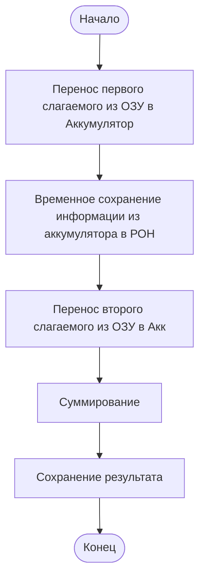
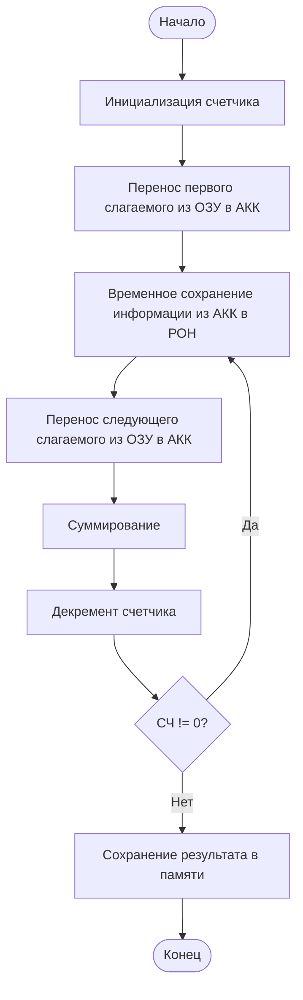
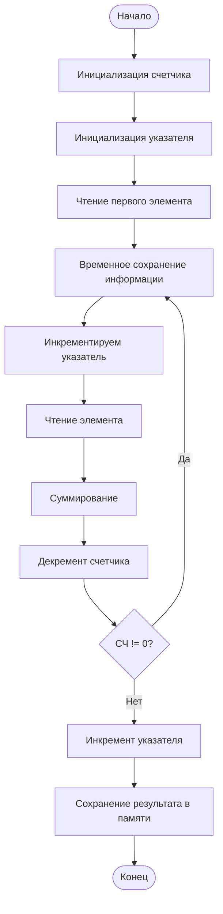
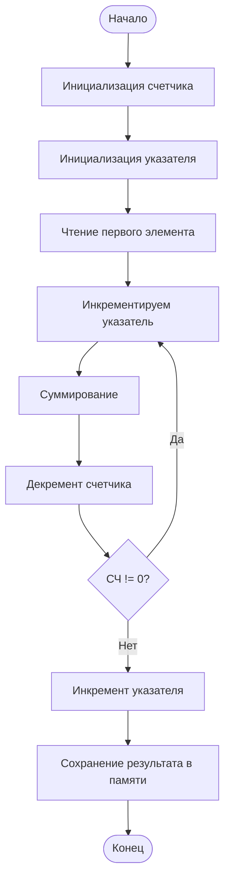
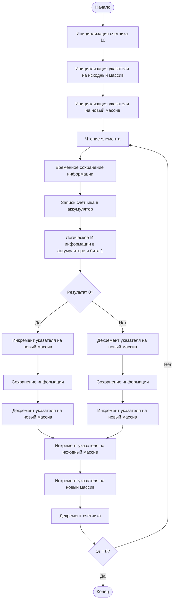
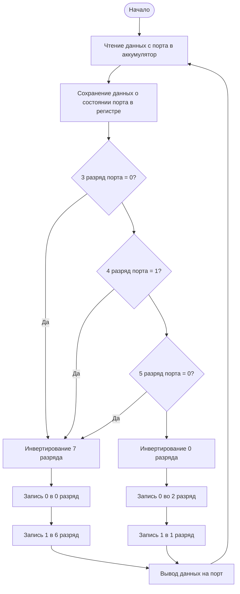

## Работа 0
**Задача**
Просуммировать содержимое ячеек памяти 0901 и 0902 в ячейку 0903
**Решение**

*РОН* - регистры общего назначения (B, C, D, E, H, L)
**Таблица**

| Адрес | Метка | Машинный код | Ассемблерный код | Комментарии                                        |
| :---- | ----- | ------------ | ---------------- | -------------------------------------------------- |
| 0800  |       | 3A           | LDA 0901h        | Перенос первого слагаемого из ячейки в аккумулятор |
| 0801  |       | 01           |                  |                                                    |
| 0802  |       | 09           |                  |                                                    |
| 0803  |       | 47           | MOV B,A          | Временное сохранение информации в РОН              |
| 0804  |       | 3A           | LDA 0902h        | Перенос второго слагаемого                         |
| 0805  |       | 02           |                  |                                                    |
| 0806  |       | 09           |                  |                                                    |
| 0807  |       | 80           | ADD B            | Суммирование                                       |
| 0808  |       | 32           | STA 0903         | Сохранение результата                              |
| 0809  |       | 03           |                  |                                                    |
| 080A  |       | 09           |                  |                                                    |
| 080B  |       | CF           | RST 1            | Останов                                            |

*LDA* - LoaD Accumulator
*STA* - STore result
Разряды младшими вперед.
У команды MOV:
- Источники - справа
- Приемники - слева
**Все арифметические команды: *первый операнд - в аккумуляторе!* в операторе только второй**
Команды работающие с регистрами - однобайтные. Все остальное - с числами.
*HLT* - завершение, но использование вызовет некорректное поведение.

#### Задача 2
**Задание**
Просуммировать элементы массива, расположенного по адресам с 0901 по 0905. Результат поместить в ячейку, расположенную за последним элементом массива (0906).
**Решение**

**На ассемблере**
- Удобнее брать цикл с постусловием;
- Выгоднее, чтобы счетчик декрементировался к нулю;
- Счетчик проверяем на неравенство нулю.
- *В теле цикла для доступа к элементам нельзя использовать прямые адреса данных.* Обработку массивов следует производить с использованием команд косвенной адресации, используя их для доступа к элементам.
**Таблица**

| Адрес | Метка | Машинный код | Ассемблерный код | Комментарии                             |
| :---- | ----- | ------------ | ---------------- | --------------------------------------- |
| 0800  |       | 0E           | MVI C,04         | Инициализация счетчика                  |
| 0801  |       | 04           |                  |                                         |
| 0802  |       | 3A           | LDA 0901         | Перенос первого слагаемого из ОЗУ в АКК |
| 0803  |       | 01           |                  |                                         |
| 0804  |       | 09           |                  |                                         |
| 0805  | M1:   | 47           | MOV B,A          | Временное сохранение информации         |
| 0806  |       | 3A           | LDA 0902         | Перенос следующего слагаемого           |
| 0807  |       | 02           |                  |                                         |
| 0808  |       | 09           |                  |                                         |
| 0809  |       | 80           | ADD B            | Сложение                                |
| 080A  |       | 0D           | DCR C            | Декремент счетчика                      |
| 080B  |       | C2           | JNZ M1           | СЧ != 0? Прыгай в 0805                  |
| 080C  |       | 05           |                  |                                         |
| 080D  |       | 08           |                  |                                         |
| 080E  |       | 32           | STA 0906         | Сохранение результата                   |
| 080F  |       | 06           |                  |                                         |
| 0810  |       | 09           |                  |                                         |
| 0811  |       | CF           | RST1             | Останов                                 |
**Но программа работать не будет, поскольку в теле цикла для доступа к элементам массива использована команда прямой адресации LDA, а в ней явно указан адрес и нет механизма его изменения.** Обработку массивов следует производить с использованием команд косвенной адресации, используя их для доступа к элементам. Подобны операциям с указателями. (STAX, LDAX)
*Имя переменной в ассемблере - это ее адрес.*
Если переменных немного - удобнее работать в регистрах. Чаще всего для счетчика выбирается регистр C.
*MVI* - MoV Integer
**Счетчик - 4, потому что одну переменную мы взяли до цикла.**
В регистре F лежит информация о последней выполненной операции
*JNZ* - Jump if Not Zero
#### Команды косвенной адресации
Решим задачу правильно с помощью команд косвенной адресации через пары BC или DE.
Регистры B, C, D, E, H, L можно скомпоновать в регистровые пары (*Только BC, DE или HL*) и хранить в них "указатели" на память.


| Адрес | Метка | Машинный код | Ассемблерный код | Комментарии                       |
| :---- | ----- | ------------ | ---------------- | --------------------------------- |
| 0800  |       | 0E           | MVI C,04         | Инициализация счетчика            |
| 0801  |       | 04           |                  |                                   |
| 0802  |       | 11           | LXI D 0901h      | Инициализация указателя           |
| 0803  |       | 01           |                  |                                   |
| 0804  |       | 09           |                  |                                   |
| 0805  |       | 1A           | LDAX D           | Чтение первого элемента           |
| 0806  | M1    | 47           | MOV B,A          | Временное сохранение информации   |
| 0807  |       | 13           | INX D            | Инкремент указателя               |
| 0808  |       | 1A           | LDAX D           | Чтение элемента                   |
| 0809  |       | 80           | ADD B            | Суммирование                      |
| 080A  |       | 0D           | DCR C            | Декремент регистра                |
| 080B  |       | C2           | JNZ M1           | Возврат в цикл, если счетчик != 0 |
| 080C  |       | 06           |                  |                                   |
| 080D  |       | 08           |                  |                                   |
| 080E  |       | 13           | INX D            | Инкремент указателя               |
| 080F  |       | 12           | STAX D           | Сохранение результата             |
| 0810  |       | CF           | RST 1            | Останов                           |
*LXI* - загрузка числа integer в пару. Указываем имя старшего регистра в паре.
*INX* - инкремент, работа с регистровой парой
![[Pasted image 20240920134221.png]]
#### Второй вариант успешного решения задачи
С использованием в качестве указателя пары HL
Это пара допускает пересулку между памятью и любым регистром (туда и обратно). Позволяет арифметические и логические операции с элементами из памяти напрямую.


| Адрес | Метка | Машинный код | Ассемблерный код | Комментарии                       |
| :---- | ----- | ------------ | ---------------- | --------------------------------- |
| 0800  |       | 0E           | MVI C,04         | Инициализация счетчика            |
| 0801  |       | 04           |                  |                                   |
| 0802  |       | 21           | LXI H 0901h      | Инициализация указателя           |
| 0803  |       | 01           |                  |                                   |
| 0804  |       | 09           |                  |                                   |
| 0805  |       | 7E           | MOV A, M         | Чтение первого элемента           |
| 0806  | M1    | 23           | INX H            | Инкремент указателя               |
| 0807  |       | 86           | ADD M            | Сложение                          |
| 0808  |       | 0D           | DCR C            | Декремент счетчика                |
| 0809  |       | C2           | JNZ M1           | Возврат в цикл, если счетчик не 0 |
| 080A  |       | 06           |                  |                                   |
| 080B  |       | 08           |                  |                                   |
| 080C  |       | 23           | INX H            | Инкремент указателя               |
| 080D  |       | 77           | MOV M, A         | Сохранение результата             |
| 080E  |       | CF           | RST 1            | Останов                           |
*MOV A, M* - здесь M - memory. Работа с указателем (косвенная адресация через пару HL).

## Задание 1
Вариант 14
***
Указатель на исходный массив не менять. Дергаем только второй (Он будет в HL).
ANA, ANI команды

0 AND 1 = 0 ЧЕТНОЕ
1 AND 1 = 1 НЕЧЕТНОЕ

| Адрес | Метка    | Машинный код | Ассемблерный код | Комментарии                                     |
| :---- | -------- | ------------ | ---------------- | ----------------------------------------------- |
| 0800  |          | 0E           | MVI C, 10        | Инициализация счетчика 10                       |
| 0801  |          | 10           |                  |                                                 |
| 0802  |          | 11           | LXI D, 0900h     | Инициализация указателя на исходный массив      |
| 0803  |          | 00           |                  |                                                 |
| 0804  |          | 09           |                  |                                                 |
| 0805  |          | 21           | LXI H, 0A00h     | Инициализация указателя на новый массив         |
| 0806  |          | 00           |                  |                                                 |
| 0807  |          | 0A           |                  |                                                 |
| 0808  | LSTART   | 1A           | LDAX D           | Чтение данных                                   |
| 0809  |          | 47           | MOV B, A         | Временное сохранение данных                     |
| 080A  |          | 79           | MOV A, C         | Запись счетчика в аккумулятор                   |
| 080B  |          | E6           | ANI 01           | Логическое И информации в аккумуляторе и бита 1 |
| 080C  |          | 01           |                  |                                                 |
| 080D  |          | C2           | JNZ EVEN         | Если нечет                                      |
| 080E  |          | 16           |                  |                                                 |
| 080F  |          | 08           |                  |                                                 |
| 0810  | ODD      | 23           | INX H            | Инкремент указателя на новый массив             |
| 0811  |          | 70           | MOV M, B         | Сохранение информации                           |
| 0812  |          | 2B           | DCX H            | Декремент указателя на новый массив             |
| 0813  |          | C3           | JMP CONTINUE     | Прыгаем в продолжение                           |
| 0814  |          | 19           |                  |                                                 |
| 0815  |          | 08           |                  |                                                 |
| 0816  | EVEN     | 2B           | DCX H            | Декремент указателя на новый массив             |
| 0817  |          | 70           | MOV M, B         | Сохранение информации                           |
| 0818  |          | 23           | INX H            | Инкремент указателя на новый массив             |
| 0819  | CONTINUE | 13           | INX D            | Инкремент указателя на исходный массив          |
| 081A  |          | 23           | INX H            | Инкремент указателя на новый массив             |
| 081B  |          | 0D           | DCR C            | Декремент счетчика                              |
| 081C  |          | C2           | JNZ LSTART       | Если счетчик не 0, прыгаем обратно              |
| 081D  |          | 08           |                  |                                                 |
| 081E  |          | 08           |                  |                                                 |
| 081F  |          | CF           | RST 1            | Останов                                         |

## Задание 2
Вариант 19
***


| Адрес | Метка | Машинный код | Ассемблерный код | Комментарии                                     |
| :---- | ----- | ------------ | ---------------- | ----------------------------------------------- |
| 0800  | ALG   | DB           | IN 05            | Чтение данных с порта в аккумулятор             |
| 0801  |       | 05           |                  |                                                 |
| 0802  |       | 47           | MOV B, A         | Сохранение данных о состоянии порта в регистре  |
| 0803  |       | E6           | ANI 08h          | Выделение третьего разряда                      |
| 0804  |       | 08           |                  |                                                 |
| 0805  |       | CA           | JZ FALSE         | 3 разряд порта = 0?                             |
| 0806  |       | 1E           |                  |                                                 |
| 0807  |       | 08           |                  |                                                 |
| 0808  |       | 78           | MOV A, B         | Считывание данных о состоянии порта из регистра |
| 0809  |       | E6           | ANI 10h          | Выделение четвертого разряда                    |
| 080A  |       | 10           |                  |                                                 |
| 080B  |       | C2           | JNZ FALSE        | 4 разряд порта = 1?<br>                         |
| 080C  |       | 1E           |                  |                                                 |
| 080D  |       | 08           |                  |                                                 |
| 080E  |       | 78           | MOV A, B         | Считывание данных о состоянии порта из регистра |
| 080F  |       | E6           | ANI 20h          | Выделение пятого разряда                        |
| 0810  |       | 20           |                  |                                                 |
| 0811  |       | CA           | JZ FALSE         | 5 разряд порта = 0?                             |
| 0812  |       | 1E           |                  |                                                 |
| 0813  |       | 08           |                  |                                                 |
| 0814  | TRUE  | 78           | MOV A, B         | Считывание данных о состоянии порта из регистра |
| 0815  |       | EE           | XRI 01h          | Инвертирование 0 разряда                        |
| 0816  |       | 01           |                  |                                                 |
| 0817  |       | E6           | ANI FBh          | Запись 0 во 2 разряд                            |
| 0818  |       | FB           |                  |                                                 |
| 0819  |       | F6           | ORI 02h          | Запись 1 в 1 разряд                             |
| 081A  |       | 02           |                  |                                                 |
| 081B  |       | C3           | JMP PRNT         |                                                 |
| 081C  |       | 25           |                  |                                                 |
| 081D  |       | 08           |                  |                                                 |
| 081E  | FALSE | 78           | MOV A, B         | Считывание данных о состоянии порта из регистра |
| 081F  |       | EE           | XRI 80h          | Инвертирование 7 разряда                        |
| 0820  |       | 80           |                  |                                                 |
| 0821  |       | E6           | ANI FEh          | Запись 0 в 0 разряд                             |
| 0822  |       | FE           |                  |                                                 |
| 0823  |       | F6           | ORI 40h          | Запись 1 в 6 разряд                             |
| 0824  |       | 40           |                  |                                                 |
| 0825  | PRNT  | D3           | OUT 05           | Вывод данных на порт                            |
| 0826  |       | 05           |                  |                                                 |
| 0827  |       | C3           | JMP ALG          |                                                 |
| 0828  |       | 00           |                  |                                                 |
| 0829  |       | 08           |                  |                                                 |
| 082A  |       |              |                  |                                                 |
| 082B  |       |              |                  |                                                 |
| 082C  |       |              |                  |                                                 |
| 082D  |       |              |                  |                                                 |
| 082E  |       |              |                  |                                                 |
| 082F  |       |              |                  |                                                 |

## Задание 3
Вариант 28
***
![[diagram(2).png]]
$$F6<X\le101$$
**YES** - 06
**NO** - 60
***


| Адрес | Метка       | Машинный код | Ассемблерный код | Комментарии                                              |
| :---- | ----------- | ------------ | ---------------- | -------------------------------------------------------- |
| 0800  |             | 11           | LXI D, 01F6      | Запись границ для сравнения в регистры                   |
| 0801  |             | F6           |                  |                                                          |
| 0802  |             | 01           |                  |                                                          |
| 0803  |             | 21           | LXI H, 0660      | Запись вывода для правильного и неправильного случая     |
| 0804  |             | 60           |                  |                                                          |
| 0805  |             | 06           |                  |                                                          |
| 0806  |             | 3A           | LDA 0900h        | Чтение первого слагаемого                                |
| 0807  |             | 00           |                  |                                                          |
| 0808  |             | 09           |                  |                                                          |
| 0809  |             | 47           | MOV B, A         | Временное сохранение информации в регистре               |
| 080A  |             | 3A           | LDA 0902h        | Чтение вычитаемого                                       |
| 080B  |             | 02           |                  |                                                          |
| 080C  |             | 09           |                  |                                                          |
| 080D  |             | 4F           | MOV C, A         | Временное сохранение информации регистре                 |
| 080E  |             | 3A           | LDA 0901h        | Чтение второго слагаемого                                |
| 080F  |             | 01           |                  |                                                          |
| 0810  |             | 09           |                  |                                                          |
| 0811  |             | 80           | ADD B            | Сложение                                                 |
| 0812  |             | D2           | JNC FIRSTBLOCK   |                                                          |
| 0813  |             | 23           |                  |                                                          |
| 0814  |             | 08           |                  |                                                          |
| 0815  |             | 91           | SUB C            | Вычитание, если произошло переполнение                   |
| 0816  |             | DA           | JC SECONDBLOCK   | Если произошел заем                                      |
| 0817  |             | 27           |                  |                                                          |
| 0818  |             | 08           |                  |                                                          |
| 0819  |             | BA           | CMP D            | Сравниваем результат с 01 (верхн. гран.)                 |
| 081A  |             | CA           | JZ PRINTTRUE     | Если результат равен верхней границе                     |
| 081B  |             | 34           |                  |                                                          |
| 081C  |             | 08           |                  |                                                          |
| 081D  |             | DA           | JC PRINTTRUE     | Если результат меньше верхней границы                    |
| 081E  |             | 34           |                  |                                                          |
| 081F  |             | 08           |                  |                                                          |
| 0820  |             | C3           | JMP PRINTFALSE   |                                                          |
| 0821  |             | 2E           |                  |                                                          |
| 0822  |             | 08           |                  |                                                          |
| 0823  | FIRSTBLOCK  | 91           | SUB C            | Вычитание, если переполнения не произошло                |
| 0824  |             | DA           | JC PRINTFALSE    | Если заем произошел                                      |
| 0825  |             | 2E           |                  |                                                          |
| 0826  |             | 08           |                  |                                                          |
| 0827  | SECONDBLOCK | BB           | CMP E            | Сравниваем результат с F6 (ниж. гран.)                   |
| 0828  |             | CA           | JZ PRINTFALSE    | Если результат равен нижней границе                      |
| 0829  |             | 2E           |                  |                                                          |
| 082A  |             | 08           |                  |                                                          |
| 082B  |             | D2           | JNC PRINTTRUE    | Если результат больше нижней границы                     |
| 082C  |             | 34           |                  |                                                          |
| 082D  |             | 08           |                  |                                                          |
| 082E  | PRINTFALSE  | 7D           | MOV A, L         | Запись 60 в акк (результат вне допустимых пределов)      |
| 082F  |             | D3           | OUT 05           | Вывод с акк на порт                                      |
| 0830  |             | 05           |                  |                                                          |
| 0831  |             | C3           | JMP END          |                                                          |
| 0832  |             | 37           |                  |                                                          |
| 0833  |             | 08           |                  |                                                          |
| 0834  | PRINTTRUE   | 7C           | MOV A, H         | Запись 06 в акк (результат в рамках допустимых пределов) |
| 0835  |             | D3           | OUT 05           | Вывод с акк на порт                                      |
| 0836  |             | 05           |                  |                                                          |
| 0837  | END         | CF           | RST 1            | Останов                                                  |
| 0838  |             |              |                  |                                                          |
| 0839  |             |              |                  |                                                          |
| 083A  |             |              |                  |                                                          |

## Задание 4
Вариант 4
***
Диапазон адресов:
**0840 - 09FF**


**ДЕКРЕМЕНТ НЕ РАБОТАЕТ С РЕГИСТРОВОЙ ПАРОЙ!!!**
НАПИСАТЬ ПОДПРОГРАММУ!

Счетчик:
*01BF*

0BF0 - младший (правый) индикатор
***

| Адрес | Метка     | Машинный код | Ассемблерный код | Комментарии                                                        |
| :---- | --------- | ------------ | ---------------- | ------------------------------------------------------------------ |
| 0800  | WRITEBITS | 16           | MVI D, E0        | Инициализация счетчика E0 в регистровой паре                       |
| 0801  |           | E0           |                  |                                                                    |
| 0802  |           | 21           | LXI H, 0840      | Инициализация указателя на <br>первый адрес проверяемого диапазона |
| 0803  |           | 40           |                  |                                                                    |
| 0804  |           | 08           |                  |                                                                    |
| 0805  | M11       | 36           | MVI M, 55        | Запись 01010101 по адресу                                          |
| 0806  |           | 55           |                  |                                                                    |
| 0807  |           | 23           | INX H            | Инкремент адреса                                                   |
| 0808  |           | 36           | MVI M, AA        | Запись 10101010 по адресу                                          |
| 0809  |           | AA           |                  |                                                                    |
| 080A  |           | 23           | INX H            | Инкремент адреса                                                   |
| 080B  |           | 15           | DCR D            | Декремент счетчика                                                 |
| 080C  |           | C2           | JNZ M11          | Z = 0?<br>(Результат != 0)                                         |
| 080D  |           | 05           |                  |                                                                    |
| 080E  |           | 08           |                  |                                                                    |
| 080F  |           | CF           | RST 1            | Останов                                                            |
| 0810  | CHECKBITS | 16           | MVI D, E0        | Инициализация счетчика E0 в регистровой паре                       |
| 0811  |           | E0           |                  |                                                                    |
| 0812  |           | 21           | LXI H, 0840      | Инициализация указателя на <br>первый адрес проверяемого диапазона |
| 0813  |           | 40           |                  |                                                                    |
| 0814  |           | 08           |                  |                                                                    |
| 0815  | M21       | 7E           | MOV A, M         | Чтение информации по адресу<br>в акк                               |
| 0816  |           | FE           | CPI 55           | Сравнение 01010101 и акк                                           |
| 0817  |           | 55           |                  |                                                                    |
| 0818  |           | C2           | JNZ M22          | Z = 0?<br>(Сравнение неуспешно?)                                   |
| 0819  |           | 2B           |                  |                                                                    |
| 081A  |           | 08           |                  |                                                                    |
| 081B  |           | 23           | INX H            | Инкремент адреса                                                   |
| 081C  |           | 7E           | MOV A, M         | Чтение информации по адресу<br>в акк                               |
| 081D  |           | FE           | CPI AA           | Сравнение 10101010 и акк                                           |
| 081E  |           | AA           |                  |                                                                    |
| 081F  |           | C2           | JNZ M22          | Z = 0?<br>(Сравнение неуспешно?)                                   |
| 0820  |           | 2B           |                  |                                                                    |
| 0821  |           | 08           |                  |                                                                    |
| 0822  |           | 23           | INX H            | Инкремент адреса                                                   |
| 0823  |           | 15           | DCR D            | Декремент счетчика                                                 |
| 0824  |           | C2           | JNZ M21          | Z = 0?<br>(Результат != 0)                                         |
| 0825  |           | 15           |                  |                                                                    |
| 0826  |           | 08           |                  |                                                                    |
| 0827  |           | CD           | CALL 05B0        | Вызов подпрограммы 05B0                                            |
| 0828  |           | B0           |                  |                                                                    |
| 0829  |           | 05           |                  |                                                                    |
| 082A  |           | CF           | RST 1            | Останов                                                            |
| 082B  | M22       | CD           | CALL WRITEINFO   | Вызов подпрограммы WRITEINFO                                       |
| 082C  |           |              |                  |                                                                    |
| 082D  |           |              |                  |                                                                    |
| 082E  |           | CD           | CALL WRITEADDR   | Вызов подпрограммы WRITEADDR                                       |
| 082F  |           |              |                  |                                                                    |
| 0830  |           |              |                  |                                                                    |
| 0831  |           | CD           | CALL 01E9        | Вызов подпрограммы 01E9                                            |
| 0832  |           | E9           |                  |                                                                    |
| 0833  |           | 01           |                  |                                                                    |
| 0834  | M23       | CD           | CALL 01C8        | Вызов подпрограммы 01C8                                            |
| 0835  |           | C8           |                  |                                                                    |
| 0836  |           | 01           |                  |                                                                    |
| 0837  |           | C3           | JMP M23          |                                                                    |
| 0838  |           | 34           |                  |                                                                    |
| 0839  |           | 08           |                  |                                                                    |
| 083A  |           |              |                  |                                                                    |
| 083B  |           |              |                  |                                                                    |
| 083C  |           |              |                  |                                                                    |
| 083D  |           |              |                  |                                                                    |
| 083E  |           |              |                  |                                                                    |
| 083F  |           |              |                  |                                                                    |
| *     | *         | *            | *                | *                                                                  |
| 0A00  | WRITEINFO | E6           | ANI 0F           | Логическое И информации в акк и 0F                                 |
| 0A01  |           | 0F           |                  |                                                                    |
| 0A02  |           | 32           | STA 0BF0         | Запись информации из акк<br>в память по адресу 0BF0                |
| 0A03  |           | F0           |                  |                                                                    |
| 0A04  |           | 0B           |                  |                                                                    |
| 0A05  |           | 7E           | MOV A, M         | Чтение информации по адресу<br>в акк                               |
| 0A06  |           | E6           | ANI F0           | Логическое И информации в акк и F0                                 |
| 0A07  |           | F0           |                  |                                                                    |
| 0A08  |           | CD           | CALL SHIFT       | 4 побитовых сдвига <br>акк вправо                                  |
| 0A09  |           | 37           |                  |                                                                    |
| 0A0A  |           | 0A           |                  |                                                                    |
| 0A0B  |           | 32           | STA 0BF1         | Запись информации из акк<br>в память по адресу 0BF1                |
| 0A0C  |           | F1           |                  |                                                                    |
| 0A0D  |           | 0B           |                  |                                                                    |
| 0A0E  |           | C9           | RET              | Выход из подпрограммы                                              |
| 0A0F  | WRITEADDR | 7D           | MOV A, L         | Чтение младшего байта адреса в акк                                 |
| 0A10  |           | E6           | ANI 0F           | Логическое И информации в акк и 0F                                 |
| 0A11  |           | 0F           |                  |                                                                    |
| 0A12  |           | 32           | STA 0BF2         | Запись информации из акк<br>в память по адресу 0BF2                |
| 0A13  |           | F2           |                  |                                                                    |
| 0A14  |           | 0B           |                  |                                                                    |
| 0A15  |           | 7D           | MOV A, L         | Чтение младшего байта адреса в акк                                 |
| 0A16  |           | E6           | ANI F0           | Логическое И информации в акк и F0                                 |
| 0A17  |           | F0           |                  |                                                                    |
| 0A18  |           | CD           | CALL SHIFT       | 4 побитовых сдвига <br>акк вправо                                  |
| 0A19  |           | 37           |                  |                                                                    |
| 0A1A  |           | 0A           |                  |                                                                    |
| 0A1B  |           | 32           | STA 0BF3         | Запись информации из акк<br>в память по адресу 0BF3                |
| 0A1C  |           | F3           |                  |                                                                    |
| 0A1D  |           | 0B           |                  |                                                                    |
| 0A1E  |           | 7C           | MOV A, H         | Чтение старшего байта адреса в акк                                 |
| 0A1F  |           | E6           | ANI 0F           | Логическое И информации в акк и 0F                                 |
| 0A20  |           | 0F           |                  |                                                                    |
| 0A21  |           | 32           | STA 0BF4         | Запись информации из акк<br>в память по адресу 0BF4                |
| 0A22  |           | F4           |                  |                                                                    |
| 0A23  |           | 0B           |                  |                                                                    |
| 0A24  |           | 7C           | MOV A, H         | Чтение старшего байта адреса в акк                                 |
| 0A25  |           | E6           | ANI F0           | Логическое И информации в акк и F0                                 |
| 0A26  |           | F0           |                  |                                                                    |
| 0A27  |           | CD           | CALL SHIFT       | 4 побитовых сдвига <br>акк вправо                                  |
| 0A28  |           | 37           |                  |                                                                    |
| 0A29  |           | 0A           |                  |                                                                    |
| 0A2A  |           | 32           | STA 0BF5         | Запись информации из акк<br>в память по адресу 0BF5                |
| 0A2B  |           | F5           |                  |                                                                    |
| 0A2C  |           | 0B           |                  |                                                                    |
| 0A2D  |           | C9           | RET              | Выход из подпрограммы                                              |
| 0A2E  | SHIFT     | 0F           | RRC              | Сдвиг акк вправо                                                   |
| 0A2F  |           | 0F           | RRC              | Сдвиг акк вправо                                                   |
| 0A30  |           | 0F           | RRC              | Сдвиг акк вправо                                                   |
| 0A31  |           | 0F           | RRC              | Сдвиг акк вправо                                                   |
| 0A32  |           | C9           | RET              | Выход из подпрограммы                                              |
| 0A33  |           |              |                  |                                                                    |
| 0A34  |           |              |                  |                                                                    |
| 0A35  |           |              |                  |                                                                    |
| 0A36  |           |              |                  |                                                                    |
| 0A37  |           |              |                  |                                                                    |
| 0A38  |           |              |                  |                                                                    |
| 0A39  |           |              |                  |                                                                    |
| 0A3A  |           |              |                  |                                                                    |
| 0A3B  |           |              |                  |                                                                    |
| 0A3C  |           |              |                  |                                                                    |
| 0A3D  |           |              |                  |                                                                    |
| 0A3E  |           |              |                  |                                                                    |
| 0A3F  |           |              |                  |                                                                    |
| 0A40  |           |              |                  |                                                                    |
| 0A41  |           |              |                  |                                                                    |

## Задание 5
Вариант 15
***
На индикаторах только 1 цифра, остальные погашены

Нумерация с нуля. Ноль - горит нулевой индикатор цифрой ноль. Один - первый индикатор цифрой 1 и т.д. 5 - горит 5 индикатор цифрой 5, 6 - ничего не меняется и т.д.
При недостоверном вводе сохраняется предыдущий вывод.

**Примечание**
От 1 до 6 - рабочий диапазон
0 - гасит все
7 и далее - не меняют вывод

Можно пробежаться по итоговым ячейкам семисегментных индикаторов и занулить неактивные.


Адрес 0BFF в HL
0BF5 в DE

В рег B текущее число
В рег C - FA

| Метка     | Ассемблерный код | Комментарии                    |
| --------- | ---------------- | ------------------------------ |
| MAIN      | MVI B, F0h       |                                |
|           | CALL SETOUTPUT   | Предварительная очистка вывода |
| BASE      | CALL 01C8h       | Вывод информации на экран      |
|           | CALL 0185h       | Определение нажатия клавиши    |
|           | JZ PRINT         | Если клавиша не нажата         |
|           | CALL 014Bh       | Сканирование клавиатуры        |
|           | CPI 00h          | Сравнение клавиши с нулем      |
|           | JZ CLEAROUT      | Если нажат ноль                |
|           | CPI 06h          | Сравнение клавиши с 6          |
|           | JZ M11           | Если нажата 6                  |
|           | JNC PRINT        | Если больше 6                  |
| M11       | MOV B, A         | Запись акк в B                 |
|           | JMP PRINT        |                                |
| CLEAROUT  | MVI B, F0h       | Для очистки вывода             |
| PRINT     | CALL SETOUTPUT   | Установка для декодирования    |
|           | CALL 01E9h       | Декодирование                  |
|           | CALL DECODE      | Очистка от лишних символов     |
|           | JMP BASE         |                                |
|           |                  |                                |
|           |                  |                                |
| DECODE    | MVI C, FAh       |                                |
|           | LXI H, 0BFFh     | Изменено                       |
|           | MVI A, FFh       |                                |
|           | SUB B            |                                |
| M21       | CMP L            | Изменено                       |
|           | JZ M22           |                                |
|           | MVI M, 00h       |                                |
| M22       | DCX H            | Изменено                       |
|           | INR C            |                                |
|           | JNZ M21          |                                |
|           | RET              |                                |
|           |                  |                                |
|           |                  |                                |
| SETOUTPUT | MVI C, FAh       |                                |
|           | LXI H, 0BF5h     |                                |
|           | MVI A, F5h       |                                |
|           | SUB B            |                                |
| M31       | CMP L            |                                |
|           | JZ M32           |                                |
|           | MVI M, 00h       |                                |
|           | JMP M33          |                                |
| M32       | MOV M, B         |                                |
| M33       | DCX H            |                                |
|           | INR C            |                                |
|           | JNZ M31          |                                |
|           | RET              |                                |
|           |                  |                                |
|           |                  |                                |
|           | MVI B, F0h       |                                |
| MTEST     | CALL DECODE      |                                |
|           | CALL 01C8h       |                                |
|           | JMP MTEST        |                                |
|           |                  |                                |
|           |                  |                                |
|           |                  |                                |
|           |                  |                                |
|           |                  |                                |

## Задание 6
Вариант 23
Справа мин приоритет, слева - макс.
Скан - обнаружение активного запроса, каждая ПП примерно 5 секунд. ПО синему алгоритму с полным покиданием.
```
л - egc - 01010100 - 54
е - abfged - 01111011 - 7B
н - fegbc - 01110110 - 76
ь - fegcd - 01111100 - 7C
у - fgbcd - 01101110 - 6E
д - bcged - 01011110 - 5E
п - abcef - 00110111 - 37
о - gced - 01011100 - 5C
з - abgcd - 01001111 - 4F
р - abgfe - 01110011 - 73
с - afed - 00111001 - 39
а - abcefg - 01110111 - 77
г - age - 00110001 - 31
```

![[mps6_print.png]]
![[mps6_main.png]]
![[mps6_delay.png]]


# Программируемые логические контроллеры
## Лаба 1
Вариант 20
*Младшие* адреса - *меньшие*

| Адрес | Канал   |
| ----- | ------- |
| 0B0h  | A       |
| 0B1h  | B       |
| 0B2h  | C       |
| 0B3h  | РУС/РСС |
## Лаба 2
Вариант 18


| № IRQ   | Надпись | Приоритет |
| ------- | ------- | --------- |
| default | забег   | default   |
| 5       | бегун   | high      |
| 1       | барьер  | middle    |
| 3       | гонг    | low       |
**Приоритеты по убыванию!!!**

Конфигурация вывода:


| Буква | Код (2)  | Код (16) |
| ----- | -------- | -------- |
| З     | 01001111 | 4F       |
| А     | 01110111 | 77       |
| Б     | 01111101 | 7D       |
| Е     | 01111001 | 79       |
| Г     | 00110001 | 31       |
| У     | 01100110 | 66       |
| Н     | 01110110 | 76       |
| Р     | 01110011 | 73       |
| Ь     | 01111100 | 7C       |
| О     | 00111111 | 3F       |

| Надпись | Основание | 0BFA     | 0BFB     | 0BFC     | 0BFD     | 0BFE     | 0BFF     |
| ------- | --------- | -------- | -------- | -------- | -------- | -------- | -------- |
| ЗАБЕГ   | 2         | 00000000 | 01001111 | 01110111 | 01111101 | 01111001 | 00110001 |
|         | 16        | 00       | 4F       | 77       | 7D       | 79       | 31       |
| БЕГУН   | 2         | 00000000 | 01111101 | 01111001 | 00110001 | 01100110 | 01110110 |
|         | 16        | 00       | 7D       | 79       | 31       | 66       | 76       |
| БАРЬЕР  | 2         | 01111101 | 01110111 | 01110011 | 01111100 | 01111001 | 01110011 |
|         | 16        | 7D       | 77       | 73       | 7C       | 79       | 73       |
| ГОНГ    | 2         | 00000000 | 00000000 | 00110001 | 00111111 | 01110110 | 00110001 |
|         | 16        | 00       | 00       | 31       | 3F       | 76       | 31       |


**Адреса портов:**
- Ведущий - 098h, 099h;
- Ведомый - 09Ch, 09Dh;

**Адреса триггеров ИЗ:**
- IRQ3 - 0B1h;
- IRQ4 - 0B2h;
- IRQ5 - 0B3h;
**Необходимы для СБРОСА состояния!**

Enable Interrupt

таблица веторов - 0A00

флажки над клавиатурой:
1. 3 левых - вверх, 1 правый - вниз, запуск
2. 2 левых - вверх, 2 правых - вниз, запуск

$D_1$(N) = 0 (ПКП не единственный)
$D_2$(h) = 1 (формат таблицы векторов кратен 4 байтам)
**КИ1 - вариант Б**

| A0  | D7  | D6  | D5  | D4  | D3  | D2  | D1  | D0  |              |
| --- | --- | --- | --- | --- | --- | --- | --- | --- | ------------ |
| 0   | A7  | A6  | A5  | 1   | -   | 1   | 0   | -   |              |
| 0   | 0   | 0   | 0   | 1   | 0   | 1   | 0   | 0   | для ведущего |
| 0   | 0   | 0   | 0   | 1   | 0   | 1   | 0   | 0   | для ведомого |

**КИ2** - старшие адреса ПП обслуживания

| A0  | D7  | D6  | D5  | D4  | D3  | D2  | D1  | D0  |              |
| --- | --- | --- | --- | --- | --- | --- | --- | --- | ------------ |
| 1   | A15 | A14 | A13 | A12 | A11 | A10 | A9  | A8  |              |
| 1   | 0   | 0   | 0   | 0   | 1   | 0   | 1   | 0   | для ведущего |
| 1   | 0   | 0   | 0   | 0   | 1   | 0   | 1   | 0   | для ведомого |

**КИ3**

| A0  | D7  | D6  | D5  | D4  | D3  | D2  | D1  | D0  |                                                  |
| --- | --- | --- | --- | --- | --- | --- | --- | --- | ------------------------------------------------ |
| 1   | U7  | U6  | U5  | U4  | U3  | U2  | U1  | U0  |                                                  |
| 1   | 1   | 0   | 0   | 0   | 0   | 0   | 0   | 1   | для ведущего (чтобы не зависел от переключателя) |
| 1   | 0   | 0   | 0   | 0   | 0   | 1   | 1   | 1   | для ведомого                                     |


**КО1**

| A0  | D7  | D6  | D5  | D4  | D3  | D2  | D1  | D0  |              |
| --- | --- | --- | --- | --- | --- | --- | --- | --- | ------------ |
| 1   | M7  | M6  | M5  | M4  | M3  | M2  | M1  | M0  |              |
| 1   | 1   | 0   | 0   | 0   | 0   | 0   | 0   | 1   | для ведущего |
| 1   | 1   | 1   | 1   | 1   | 1   | 1   | 1   | 1   | для ведомого |

**КО2**

| A0  | D7  | D6  | D5  | D4  | D3  | D2  | D1  | D0  |
| --- | --- | --- | --- | --- | --- | --- | --- | --- |
| 0   | 0   | 1   | 1   | 0   | 0   | B2  | B1  | B0  |
| 0   | 0   | 1   | 1   | 0   | 0   | 1   | 0   | 0   |
Вариант Д при конфигурации. 4 вертикаль таблицы распределения приоритетов.

| A0  | D7  | D6  | D5  | D4  | D3  | D2  | D1  | D0  |
| --- | --- | --- | --- | --- | --- | --- | --- | --- |
| 0   | 0   | 0   | 1   | 0   | 0   | 0   | 0   | 0   |
| 0   | 0   | 0   | 1   | 0   | 0   | 0   | 0   | 0   |
Вариант А после выполнения ПП


## Таблица листинга
| Адрес | Метка | Машинный код | Ассемблерный код | Комментарии |
| :---- | ----- | ------------ | ---------------- | ----------- |
| 0800  |       |              |                  |             |
| 0801  |       |              |                  |             |
| 0802  |       |              |                  |             |
| 0803  |       |              |                  |             |
| 0804  |       |              |                  |             |
| 0805  |       |              |                  |             |
| 0806  |       |              |                  |             |
| 0807  |       |              |                  |             |
| 0808  |       |              |                  |             |
| 0809  |       |              |                  |             |
| 080A  |       |              |                  |             |
| 080B  |       |              |                  |             |
| 080C  |       |              |                  |             |
| 080D  |       |              |                  |             |
| 080E  |       |              |                  |             |
| 080F  |       |              |                  |             |
| 0810  |       |              |                  |             |
| 0811  |       |              |                  |             |
| 0812  |       |              |                  |             |
| 0813  |       |              |                  |             |
| 0814  |       |              |                  |             |
| 0815  |       |              |                  |             |
| 0816  |       |              |                  |             |
| 0817  |       |              |                  |             |
| 0818  |       |              |                  |             |
| 0819  |       |              |                  |             |
| 081A  |       |              |                  |             |
| 081B  |       |              |                  |             |
| 081C  |       |              |                  |             |
| 081D  |       |              |                  |             |
| 081E  |       |              |                  |             |
| 081F  |       |              |                  |             |
| 0820  |       |              |                  |             |
| 0821  |       |              |                  |             |
| 0822  |       |              |                  |             |
| 0823  |       |              |                  |             |
| 0824  |       |              |                  |             |
| 0825  |       |              |                  |             |
| 0826  |       |              |                  |             |
| 0827  |       |              |                  |             |
| 0828  |       |              |                  |             |
| 0829  |       |              |                  |             |
| 082A  |       |              |                  |             |
| 082B  |       |              |                  |             |
| 082C  |       |              |                  |             |
| 082D  |       |              |                  |             |
| 082E  |       |              |                  |             |
| 082F  |       |              |                  |             |
| 0830  |       |              |                  |             |
| 0831  |       |              |                  |             |
| 0832  |       |              |                  |             |
| 0833  |       |              |                  |             |
| 0834  |       |              |                  |             |
| 0835  |       |              |                  |             |
| 0836  |       |              |                  |             |
| 0837  |       |              |                  |             |
| 0838  |       |              |                  |             |
