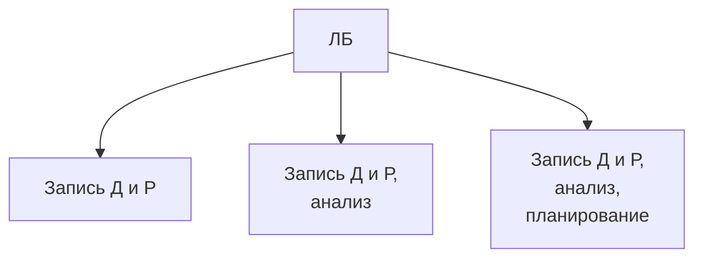

**Минникова Юлия Михайловна**
Кафедра - корабль кабинет 618
***
## Доходы и расходы
#### Доходы
- Денежные
	- В деньгах
- Натуральные
	- Продукты, товары и прочее
		- Продать (*Д* - растут / *Р* - {0\\падают})
		- Употребить (*Д* - {падают\\0} / *Р* - падают)
*Или*
- Трудовые (З/П)
	- Сдельная (зп)
- Нетрудовые (Пассивные)
	- Дивиденды
	- Наследство
	- Выигрыш
	- Аренда
*Или*
- Легкие деньги 
	- Без усилий
- Трудные деньги 
	- Заработанные тяжелым трудом

На психологическом уровне 1 рубль легких денег не равен одному рублю тяжелых. 

##### Виды доходов
1) З/П
	- Плюсы:
		- Стабильность
			- Планировать 
			- Брать кредиты и тп.
	- Минусы:
		- Карьерный рост не всегда возможен
		- Труд оценивается работодателем
2) Доходы от предпринимательской деятельности
	- Плюсы:
		- Работа на себя (независимость)
		- Карьерный рост
		- Сам оцениваешь свой труд
	- Минусы:
		- Высокие риски
		- *Расходы* будут всегда, *доходы* - нет
	- **Важно учитывать**:
		- ЦА
		- Местоположение
3) Пособия и льготы
	- Типы:
		- Многодетные
		- Малоимущие
		- Дети - сироты
		- Инвалиды
4) Рента
	- Виды:
		- Аренда кв.
***
ДЗ: **Эссе на тему "На что я хочу накопить"**

***
### Ведущий тип деятельности (ВТД)

| Период                   | Способ развития         |
| :----------------------- | ----------------------- |
| Младенчество             | Общение с матерью       |
| Дошкольный               | Сюжетно-ролевая игра    |
| Младший школьный возраст | Учебная деятельность    |
| Подростковый             | Общение со сверстниками |
| Юношество                | Проф. ориентация        |
| Взрослый                 | Работа                  |
## Личный бюджет
*Личный бюджет* - личный капитал, деньги которые есть.
*Ведение личного бюджета* - система записей о доходах и расходах.
***
#### Зачем ЛБ?
- Обычно нехватка денег (дефицит). ЛБ дает понимание о наших доходах и расходах (что можем себе позволить)
- Деньги уходят на мелочи. ЛБ дает нам возможность себя контролировать.
- Не хватает денег - берем в долг. Понимаем - сможем ли мы эти деньги вернуть.
##### Как вести ЛБ

***
**ЛБ:**
- Дает нам достоверную информацию о Д и Р
- Повышает финансовую дисциплину
- М знаем, на что тратятся деньги, и как уменьшить расходы
- Страхует нас от попадания в долговую яму
- Дает возможность ставить финансовые цели и достигать их
#### Цели
Цель:
- Маленькая (машина)
- Большая (квартира, собственный бизнес) - *мотивирует*
***
##### Действие 1. Поставить цель
Цель: Накопить на первоначальный взнос (15%) за квартиру
**Пример 1.**

| Параметры          | Количество                         |
| :----------------- | :--------------------------------- |
| Стоимость          | 2кк рублей                         |
| Сумма ПВ           | 300к рублей                        |
| Срок               | 3 года                             |
| ЗП                 | 50000 рублей                       |
| Ежемесячный отклад | $300000 R/36 month = 8400 R/month$ |
**Пример 2.**

| Параметры          | Количество                          |
| :----------------- | :---------------------------------- |
| Стоимость          | 6кк рублей                          |
| Сумма ПВ           | 900к рублей                         |
| Срок               | 3 года                              |
| ЗП                 | 80000 рублей                        |
| Ежемесячный отклад | $900000 R/36 month = 25200 R/month$ |
##### Действие 2. Рассчитать оставшуюсь сумму для погашения
***Важно: Можно откладывать не более 20-30% от ежемесячного дохода***

**Пример 1.**
$8600 / 50000 * 100\% = 16,8\%$
*OK*
**Пример 2.**
$25200 / 80000 * 100\% = 31,52\%$
*Не OK*
Либо увеличиваем срок, либо уменьшаем сумму, либо и первое и второе.

##### Действие 3. Оптимизируем расходы
- Снижаем коммунальные расходы (энергосберегающие лампочки);
- Отказываемся от абонементов (спортзал, подписки на интернет-сервисы);
- Отказ от бьюти-услуг;
- Закупка оптом;
- Отказ от пользования личным транспортом, пользование общественным;
- Минимизировать рестораны, кафе, досуг;
- Минимизировать расходы на одежду, безделушки.

##### Действие 4. Выбор финансовых инструментов
- Банковский вклад (накопительный счет)
	- Плюсы - самый безопасный вариант, возврат до 1.4кк при банкротстве банка
	- Минусы - маленький процент
- Ценные бумаги
	- Плюсы - доход выше
	- Минусы - очень высокий риск
- Паевые инвестиционные фонды
	- Плюсы - потери меньше, чем при прямой покупке ценных бумаг
	- Минусы - риски те же
- Обезличенный металлический счет (НДФЛ накладывается на счет, во владении менее 3 лет)
- Накопительное страхвание жизни, программа долгосрочных сбережений (негосударственные пенсионные фонды)

### ДЗ
Составить личный бюджет

## Инфляция
## Простые и сложные проценты
- Вклад
- Кредит
***
#### Простые проценты
$$S_n = S_0 (1 + rn)$$
$S_n$ - Будущая сумма
$S_0$ - Сумма изначальная
$r$ - Процентная ставка (в долях единицы)
$n$ - Срок (количество периодов, за которое начисляются проценты).
#### Сложные проценты
$$S_n = S_0(1 + r)^n$$
Прописано в условиях: "Капитализация %"

## Вклады и сбережения
Есть 2 категории выплат:
1. Выплата процентов в конце срока (ежедневная капитализация)
2. Ежеквартальная капитализация
3. Ежемесячная капитализация

## Кредиты и займы

## Промежуточная аттестация. Конспекты.
### Обязательное страхование в России

