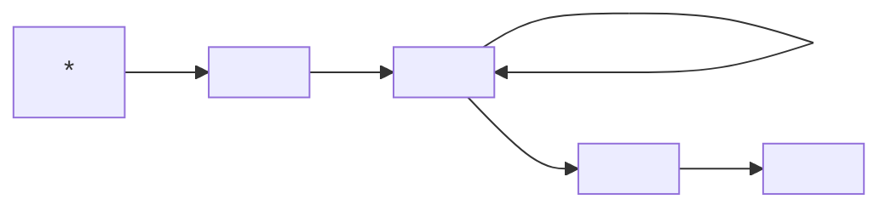

Самаркин Александр Иванович
НТЦ Юнити-парк
+79212173305
alexsamarkinru@gmail.com
***
## Лекция 1
**Инженерия программного обеспечения** - это систематический, упорядоченный и измеримый подход.
- Существует регламент на выполнение программных работ
- Их результат можно измерить
Жизненный цикл программы
1. Разработка
2. Сопровождение
Жизненный цикл ПО:

Основные стадии жизненного цикла ПО:
1. Анализ требований
2. Проектирование
3. Разработка
4. Тестирование
5. Внедрение
6. Сопровождение

Качество ПО - это способность выполнять задачу пользователя.

1. Процесс приобретения ПО
2. Процесс приемки
3. Процесс сопровождения
4. Аудит
5. Разрешение конфилктов

## Для самостоятельного изучения
UML
BPMN
ArchiMate

## Модели разработки
V-образная
Инкрементная
Спиральная
Итеративная
***
Компонентная модель