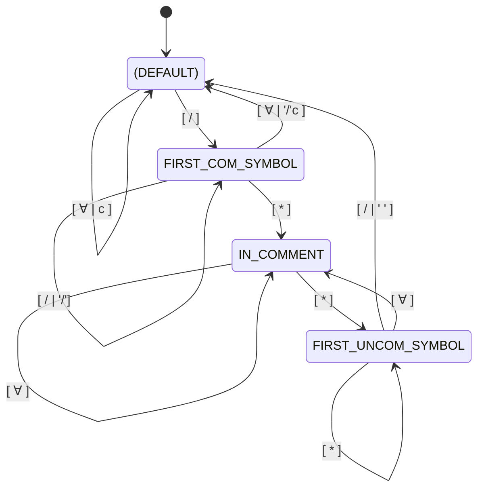
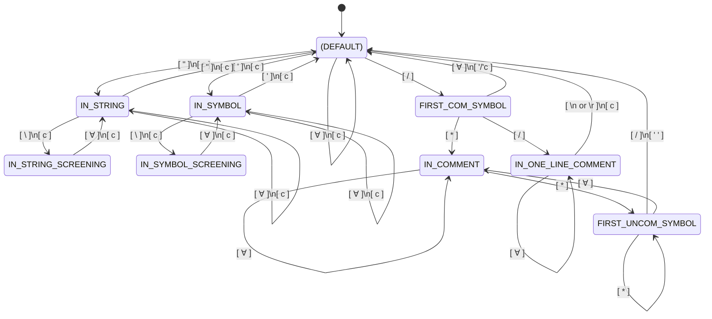

## Task 1

```mermaid
stateDiagram

[*]-->(DEFAULT)

(DEFAULT)-->FIRST_COM_SYMBOL: [ / ]
(DEFAULT)-->(DEFAULT): [ ∀ | c ]
FIRST_COM_SYMBOL-->IN_COMMENT: [ * ]
FIRST_COM_SYMBOL-->FIRST_COM_SYMBOL: [ / | '/']
FIRST_COM_SYMBOL-->(DEFAULT): [ ∀ | '/'c ]
IN_COMMENT-->FIRST_UNCOM_SYMBOL: [ * ]
IN_COMMENT-->IN_COMMENT: [ ∀ ]
FIRST_UNCOM_SYMBOL-->(DEFAULT): [ / | ' ' ]
FIRST_UNCOM_SYMBOL-->FIRST_UNCOM_SYMBOL: [ * ]
FIRST_UNCOM_SYMBOL-->IN_COMMENT: [ ∀ ]
```
## Task 2

```mermaid
stateDiagram

[*]-->(DEFAULT)

(DEFAULT)-->FIRST_COM_SYMBOL: [ / ]
(DEFAULT)-->IN_STRING: [ " ]\n[ c ]
(DEFAULT)-->IN_SYMBOL: [ ' ]\n[ c ]
(DEFAULT)-->(DEFAULT): [ ∀ ]\n[ c ]

IN_STRING-->(DEFAULT): [ " ]\n[ c ]
IN_STRING-->IN_STRING_SCREENING: [ \ ]\n[ c ]
IN_STRING-->IN_STRING: [ ∀ ]\n[ c ]

IN_STRING_SCREENING-->IN_STRING: [ ∀ ]\n[ c ]

IN_SYMBOL-->(DEFAULT): [ ' ]\n[ c ]
IN_SYMBOL-->IN_SYMBOL_SCREENING: [ \ ]\n[ c ]
IN_SYMBOL-->IN_SYMBOL: [ ∀ ]\n[ c ]

IN_SYMBOL_SCREENING-->IN_SYMBOL: [ ∀ ]\n[ c ]

FIRST_COM_SYMBOL-->IN_COMMENT: [ * ]
FIRST_COM_SYMBOL-->IN_ONE_LINE_COMMENT: [ / ]
FIRST_COM_SYMBOL-->(DEFAULT): [ ∀ ]\n[ '/'c ]

IN_COMMENT-->FIRST_UNCOM_SYMBOL: [ * ]
IN_COMMENT-->IN_COMMENT: [ ∀ ]

IN_ONE_LINE_COMMENT-->(DEFAULT): [ \n or \r ]\n[ c ]
IN_ONE_LINE_COMMENT-->IN_ONE_LINE_COMMENT: [ ∀ ]

FIRST_UNCOM_SYMBOL-->(DEFAULT): [ / ]\n[ ' ' ]
FIRST_UNCOM_SYMBOL-->FIRST_UNCOM_SYMBOL: [ * ]
FIRST_UNCOM_SYMBOL-->IN_COMMENT: [ ∀ ]
```
