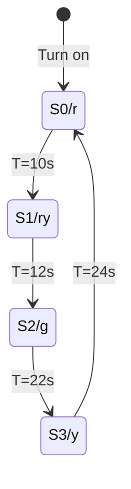
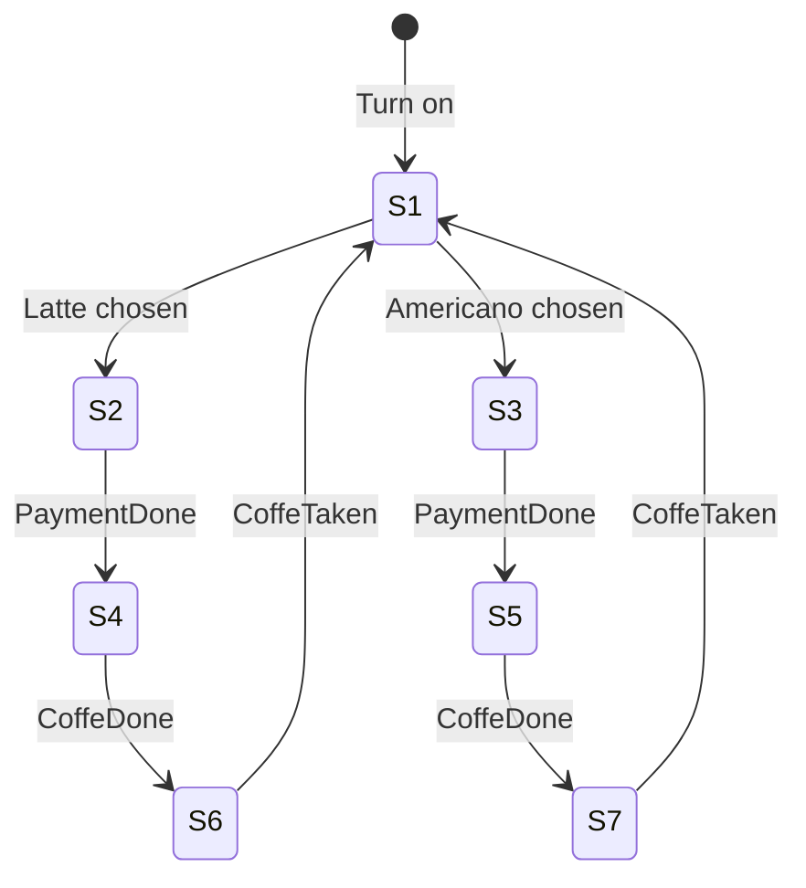

## Процесс и ...
...
### Процесс
#### Определение и свойства
Процесс есть тройка (Q, f, g), где
- Q - множество состояний процесса;
- f - функция действия f: $Q\to Q$;
- $g\subseteq Q$ - начальное состояние процесса.

*Свойства:*
- Процесс не является закрытой системой и может взаимодействовать с другими процессами, воспринимая или изменяя часть среды, которую он с ними разделяет;
- Каждый процесс живет лишь временно. Имеется также "главный" процесс, запускаемый, например, при включении компьютера, который начинает всю цепочку процессов;
- В любой момент времени процесс может быть описан его состоянием. Все параметры (переменные), характеризующие состояние процесса, объединяются в "вектор состояний" или "слово состояний", который позволяют возобновить процесс после его прерывания, в том числе и локальную среду.

### Таблица состояний и переходов между ними
Описание работы технических объектов (процессов) можно производить **диаграммой состояний** и **таблицей переходов**.

Сигнал, под воздействием которого процесс переходит из одного состояния в другое может быть как внутренним, так и внешним.

*Диаграмма состояний*
![[Pasted image 20250205151749.png]]

*Таблица переходов*
![[Pasted image 20250205151716.png]]

#### Таблица переходов
**Одномерная таблица переходов:**
*(S: состояние, I: вход, O: выход)*
![[Pasted image 20250205152214.png]]
***
**Двумерная таблица переходов:**
*(S: состояние, I: вход, O: выход)*
![[Pasted image 20250205152333.png]]

#### Светофор
##### Таблица переходов для светофора
![[Pasted image 20250205154545.png]]

##### Граф переходов для трехцветного светофора
Пример:
![[Pasted image 20250205154958.png]]

Реализация:

## Частные случаи цифровых автоматов

Возможны 4 случая:
1. Автомат зависит от состояния и входов - *автомат Мили*;
2. Автомат зависит только от состояния - *автомат Мура*;
3. Автомат зависит только от входов - *комбинационная логика*;
4. Автомат ни от чего не зависит - *генератор константы*.

#### Классический цифровой автомат
КЦА

![[Pasted image 20250219150852.png|Обозначение]]

Здесь:
- X - набор входных значений;
- f(X) - функция их обработки;
- Y - набор результирующих значений.

![[Pasted image 20250219152126.png|Смена состояний у ЦА происходит мгновенно (такт синхроимпульса)]]

$y(t)=\lambda(a(t-1), x(t))$

![[Pasted image 20250219152108.png|Полное описание состояний ЦА]]

#### Параллельный цифровой автомат
ПЦА

![[Pasted image 20250219152440.png]]

![[Pasted image 20250219152707.png]]

![[Pasted image 20250219152902.png]]

##### Реализация вендингового автомата

$S_0$ - Off
$S_1$ - Ready
$S_2$ - PaymentPendingLatte
$S_3$ - PaymentPendingAmericano
$S_4$ - LatteMaking
$S_5$ - AmericanoMaking
$S_6$ - LatteReady
$S_7$ - AmericanoReady

## Процессы последовательные и параллельные
Граф развития процеса -> трасса развития процесса по времени.

Ход вычисления можно показать в виде дерева.

### Типы параллелизма

## Машина тьюринга

## Сети петри

### Виды узлов

1. 